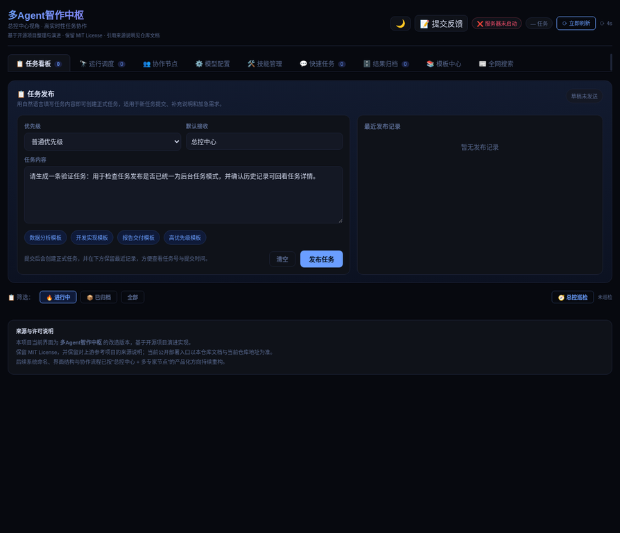
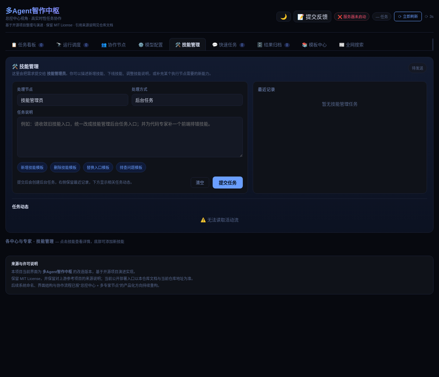
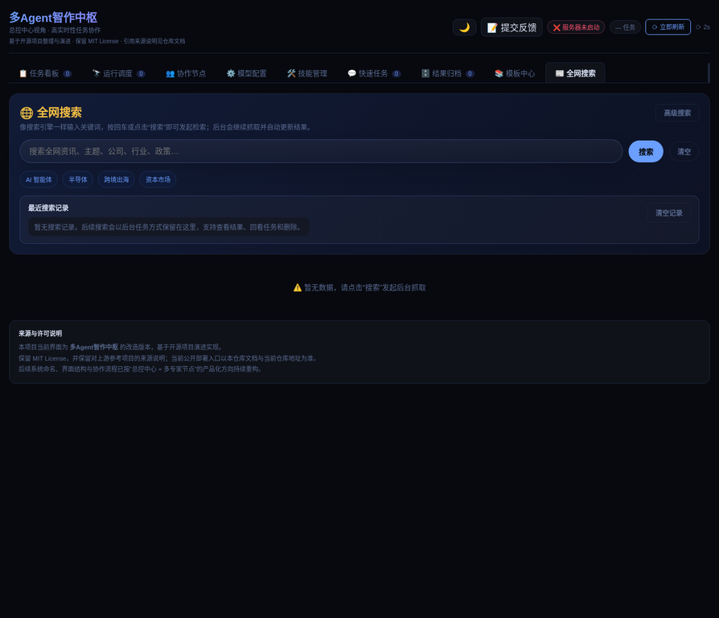

# Multi-Agent Orchestrator

> **中文简介：一个默认以中文部署、中文运行为主，并面向复杂任务治理场景设计的多智能体协作编排系统。**
>
> **English Description: A public, deployment-ready multi-agent orchestration system designed for governed execution of complex tasks, with Chinese as the default deployment and operating language.**
>
> 本仓库强调**任务分阶段治理、执行过程可观测、结果可归档、角色模板可替换、看板可继续产品化扩展**。同时，它也可以概括为：**a governed workflow framework that emphasizes staged task execution, dashboard visibility, reusable role templates, and auditable result archiving**。它既适合作为公开仓库展示，也适合作为部署底座、二次开发基础工程，以及供部署阶段 AI 直接读取的主入口文档。

## 项目概述

**Multi-Agent Orchestrator** 用于把复杂任务放入一条可治理、可观测、可审查、可归档的执行链路，而不是把多个 Agent 简单拼接为一个单点对话入口。对应的英文概括为：**Multi-Agent Orchestrator routes complex work through a governed, observable, reviewable, and archivable execution pipeline instead of collapsing multiple agents into one undifferentiated chat entry.** 系统将任务依次纳入**任务入口、总控预处理、规划拆解、评审把关、调度派发、专业执行、结果归档**等阶段，以降低多人协作与多代理协作过程中的混乱、遗漏与不可追踪风险。

本公开版已经完成面向公共仓库的脱敏整理，保留了看板、后端、前端、角色模板、文档和部署入口，同时移除了不适合公开发布的私有环境文件、本地运行数据、审查留痕和敏感配置。当前版本的重点边界如下：

| 维度 | 当前策略 |
| --- | --- |
| 默认部署语言 | **中文** |
| 默认界面语言 | **中文** |
| 对外主名称 | **Multi-Agent Orchestrator** |
| 看板语言策略 | 默认中文；允许继续扩展为中英文切换 |
| 角色模板策略 | 默认保留中文主语义；如需英文 SOUL，请在部署阶段单独生成 |
| 公开发布要求 | 必须保留许可证与来源说明，不得提交敏感数据 |
| Docker 支持策略 | **不提供 Docker 镜像、容器编排与相关维护支持** |

## 项目流程图

考虑到 GitHub README 中单张长链路流程图在缩放后容易变得**过细、过长且难以辨认**，即便已经拆成几张图，如果仍把“治理主链路、评审回退、调度扇出与归档汇聚”压在同一张图里，视觉上依然会显得拥挤。因此本仓库进一步把工作流程重构为**五张更短、更清晰、职责更单一的分段流程图**，让读者按照“治理入口 → 评审回路 → 执行收敛 → 部署路径 → 看板闭环”的顺序逐步理解系统。

### 1. 治理入口主链路

这张图只保留任务从进入系统到进入调度前的主干路径，用于帮助读者快速建立系统的治理骨架：任务不会直接落到某个 specialist，而是先经过统一入口、总控、规划与评审，再进入可监督的调度节点。


> 这张图回答的问题是：**任务如何从用户输入进入治理体系，并被推进到可调度状态**。[1]

### 2. 评审回退与放行机制

这张图单独表达规划中心与评审中心之间的往返关系。这样做的目的是把“是否通过”“退回修订”“继续放行”从主图中剥离出来，避免把回路线和主链路叠在一起导致阅读困难。


> 这张图回答的问题是：**规划结果如何被评审，未通过时如何退回修订，通过后又如何进入调度阶段**。[1]

### 3. 调度、专业执行与结果归档

这张图单独表达调度中心如何把任务派发给多个专业角色，并在专业执行完成后先进入**上下文整理压缩**，再汇聚到结果归档、最终交付检查与最终交付。这里补上了两个原先缺失但很关键的约束：第一，**长任务或多阶段任务不能只依赖即时上下文，必须先沉淀可回读的稳定摘要，再进入交付链路**；第二，**结果归档之后不能直接宣告完成，必须先经过最终交付检查；若检查不通过则回到修复链路继续处理，若存在无法自行拍板的取舍或分歧，则回到用户确认后再继续推进**。由于不再和前置治理链路混在同一张图中，调度扇出、上下文收敛、验收关卡与归档收敛会更容易辨认。


> 这张图回答的问题是：**调度中心如何组织多个 specialist，并在上下文整理、结果归档、最终检查、返修分流与用户确认机制之后收敛为单一交付出口**。[1]

### 4. 部署与验证链路

这张图用于说明公开版推荐的部署思路。重点不是一上来就执行脚本，而是**先读 README、先检查环境、先判断是否已有运行时，再决定走增量接入还是首次部署**。`install.sh` 与 `install.ps1` 依然保留，但只作为有明确理由时才调用的条件性入口。


> 推荐顺序为：**阅读说明 → 审视环境 → 判断接入方式 → 由 AI 规划最小命令集 → 必要时才调用脚本 → 验证服务与看板 → 进入治理链路**。

### 5. 看板运行与反馈链路

这张图用于说明部署完成之后，日常如何通过看板观察系统状态、跟踪任务、调整调度、查看会话与日志，并最终把产出沉淀为报告和归档结果。它对应的是**运行期可观测性与闭环反馈**，而不是首次部署动作本身。


> 看板闭环的重点是：**监控状态、跟踪任务、调度调整、专家执行、汇总产出、结果归档、反馈运营者**，并通过日志、会话视图与报告记录持续补足运行可见性。

下表概括五张图在 README 中各自承担的作用，方便读者按需阅读。

| 流程图 | 主要回答的问题 | 适合谁先看 |
| --- | --- | --- |
| 治理入口主链路 | 任务怎样进入治理体系并推进到可调度状态 | 首次访问仓库的访客、方案评审者 |
| 评审回退与放行机制 | 规划结果如何被审查、退回与放行 | 架构评审者、流程设计者 |
| 调度、专业执行与结果归档 | 调度后如何扇出执行并重新汇聚为最终交付 | Specialist 设计者、二次开发者 |
| 部署与验证链路 | 部署阶段为什么应先由 AI 审视环境再执行命令 | 部署执行者、运维协作者 |
| 看板运行与反馈链路 | 部署后如何在看板里观察、调度与归档 | 日常运营者、二次开发者 |

> 五张流程图共同构成公开版项目的完整阅读入口：**先理解治理入口，再理解评审回路与执行收敛，随后理解部署方式，最后理解运行闭环**。[1]

## 最新界面预览

为了让公开访客在阅读 README 时就能快速理解本轮界面改造的方向，下面补入三张来自本地运行态的最新预览图，分别对应**任务发布、技能管理、全网搜索**三个关键模块。当前截图保留了真实运行环境的状态提示，因此个别位置仍能看到服务状态或认证限制带来的空态提示；这类内容属于运行环境约束，不代表界面结构尚未落地。

| 模块 | 当前界面重点 | 运行态预览 |
| --- | --- | --- |
| 任务发布 | 标题已收口为**任务发布**，作为统一任务入口使用 |  |
| 技能管理 | 已切换为**技能管理**命名，并接入后台任务入口与任务动态区 |  |
| 全网搜索 | 采用搜索引擎式输入入口，并保留后台任务历史与结果查看区 |  |

本轮界面改造还同步收敛了可见文案与技术字段展示，避免把内部兼容标识直接暴露给最终用户。与此同时，任务详情中的流程链路也已从固定阶段展示逐步调整为**按具体任务动态生成**：系统会优先依据任务自己的流转记录、当前节点、回退、改派、重试与升级信息生成流程，而不是假定所有任务都遵循同一条静态路径。

## 给部署阶段 AI 的主入口说明

如果你是在**部署阶段把本 README 交给 AI 直接读取**，请把本文件视为仓库最高优先级的说明文档，并严格优先遵守这里定义的边界、顺序与术语，而不是先依据零散脚本、历史注释或兼容字段自行猜测部署方式。

### AI 需要先理解的核心原则

1. **默认部署语言是中文**。不要未经确认就把默认界面整体改成英文。
2. **公开默认界面只能使用新的 center / specialist 命名体系**。像“中书省”“门下省”“尚书省”“礼部”“吏部”等旧代号不应再作为公开默认文案出现。
3. **来源说明必须保留，但不能把引用仓库当作当前官方入口**。上游引用用于说明来历，不代表当前用户应跳转到旧仓库进行部署。
4. **看板是部署后的核心可见入口**。任何部署验证都应优先确认看板、任务流、状态显示与归档能力是否正常。
5. **AI 部署是第一推荐路径**。应优先让部署阶段 AI 先完成环境审视、命令规划、风险提示与执行顺序设计，再决定采用安装脚本还是增量命令。
6. **安装脚本保留，但属于执行工具而不是文档主叙事中心**。公开文档应先说明 AI 部署路径，再把 `install.sh` / `install.ps1` 作为可调用入口列出。
7. **Docker 不属于当前交付与维护范围**。请不要把 Dockerfile、容器编排或历史镜像说明视为受支持的默认部署入口。
8. **SOUL 不要求仓库内默认提供完整英文版**。若部署目标是英文场景，请在部署阶段单独生成一份英文改写提示词，不要直接把中文主仓库整体替换成英文。

### AI 推荐执行顺序

| 步骤 | 建议动作 | 目标 |
| --- | --- | --- |
| 1 | 先完整阅读本 README | 建立统一术语、部署边界与正式命名体系 |
| 2 | 让 AI 先审视当前 OpenClaw 环境、可用模型和已存在工作区 | 明确是首次接入还是增量更新 |
| 3 | 检查 `dashboard/` | 确认可视化入口、页面文案和服务方式 |
| 4 | 检查 `edict/backend/` 与 `edict/frontend/` | 确认前后端服务、构建方式与接口入口 |
| 5 | 检查 `agents/` 与 `scripts/` | 在需要定制角色、同步 SOUL 或执行安装脚本时再处理 |
| 6 | 生成部署执行清单后再落命令 | 降低误部署、误覆盖与漏检风险 |
| 7 | 部署前复扫公开材料 | 确保没有旧链接、旧主品牌或敏感信息残留 |

### AI 不应直接做的事情

| 不建议操作 | 原因 |
| --- | --- |
| 全局替换所有历史字段、状态名或旧别名 | 部分旧值可能仅用于历史数据兼容 |
| 删除 `LICENSE` 或来源说明 | 会破坏许可要求与引用链条 |
| 未验证看板、后端、前端协作就宣称部署完成 | 容易造成“假成功” |
| 把默认中文界面直接改为英文默认 | 不符合当前交付边界 |
| 把引用仓库链接作为当前官方部署入口写回文档 | 会误导公开仓库访客 |

## 仓库定位

本项目公开版是一套**可启动、可观察、可改造、可继续产品化**的多智能体协作编排基础工程，而不是仅供截图展示的概念样例。它适合以下用途：

| 用途 | 说明 |
| --- | --- |
| 架构参考 | 用于理解多阶段任务治理、多角色协作和结果归档的系统设计 |
| 演示系统 | 用作团队展示、方案验证或交互看板演示 |
| 二次开发底座 | 在保留公开发布边界的前提下继续接入行业术语、业务流程和专用角色 |
| AI 部署入口 | 作为部署阶段 AI 的主说明文件，减少误判和误配 |

### 当前不适合的使用方式

| 场景 | 原因 |
| --- | --- |
| 期待“一条命令从零搭起完整 OpenClaw 生产环境” | 本仓库当前默认前提是你已经具备基本可用的 OpenClaw 运行环境 |
| 期待官方维护 Docker / Compose / K8s 发布链路 | 当前公开版不以容器化交付为主线，相关材料如存在也仅视为历史遗留 |
| 期待英文默认界面与英文 SOUL 作为主版本 | 当前默认体验和默认语义仍以中文为主，英文切换属于补充能力 |
| 期待直接公开内部日志、运行快照与真实演示数据 | 公开发布边界要求持续脱敏，运行上下文不应直接随仓库公开 |
| 期待把历史兼容字段直接作为最终 UI 文案 | 兼容值仅应用于内部映射层，不适合作为公开展示口径 |

> **建议理解方式：** 把这个仓库看作“适合接到现有环境、可继续产品化的公开工程底座”，而不是“替你包办一切运行时前置条件的全集成安装包”。


## 公开仓库信息与协作入口

为了让公开访客、部署阶段 AI 与后续贡献者对仓库定位有一致认识，建议把本仓库视为一个**面向公开发布、可继续产品化、并保留上游引用关系的治理型多智能体工程底座**，而不是一次性演示包。

| 项目元信息 | 当前公开口径 |
| --- | --- |
| 仓库名称 | `multi-agent-orchestrator` |
| 展示标题 | **Multi-Agent Orchestrator** |
| 仓库定位短描述 | 面向生产风格任务治理、调度派发、执行观测与看板可视化的多智能体编排系统 |
| 默认公开语言 | 中文优先，英文作为可切换辅助层 |
| 作者署名 | **JiangNanGenius** |
| 开源协议 | **MIT License** |

如果你准备继续公开维护本仓库，建议同步维护 GitHub About、README 标题描述、仓库 Topics 与 Release 说明，避免仓库首页与 README 主文档口径再次分裂。

| 公开协作入口 | 当前建议 |
| --- | --- |
| Issues | 使用当前公开仓库的 Issue 入口集中反馈问题 |
| Security Advisories | 使用 GitHub 私密安全通道提交漏洞报告 |
| Pull Requests | 采用 fork + feature branch 的标准提交流程 |
| 公开说明更新 | README、`CONTRIBUTING.md`、`SECURITY.md` 保持同步 |

## 系统架构与默认术语

本仓库当前默认使用**现代中文架构表述**。如果历史数据、旧接口或兼容层里仍出现旧式角色代号，应在内部做映射，不应直接暴露给访客或最终用户。

### 推荐对外术语

| 阶段/角色 | 对外推荐名称 | 说明 |
| --- | --- | --- |
| 任务入口 | 任务入口 | 接收与记录用户任务 |
| 总控预处理 | 总控中心 | 对任务进行整理、判断与推进 |
| 规划拆解 | 规划中心 | 拆解任务、形成执行方案 |
| 评审把关 | 评审中心 | 检查方案、风险与质量 |
| 调度派发 | 调度中心 | 选择执行角色并监控进度 |
| 专业执行 | 专业执行组 / 专家节点 | 承接具体执行工作 |
| 结果归档 | 结果报告 / 结果归档 | 汇总、沉淀与可追溯留档 |

### 兼容层处理原则

| 情况 | 处理方式 |
| --- | --- |
| 历史状态名仍存在于旧 JSON、旧接口或演示数据 | 允许保留，但必须在渲染层转换为现代中文名称 |
| 历史角色名仍存在于内部模板或兼容映射表 | 允许保留，但不得作为默认展示文案 |
| 旧仓库链接、旧主品牌、旧宣传入口 | 在公开仓库中应移除或降级为纯引用说明 |

## 目录结构

```text
multi-agent-orchestrator/
├── README.md
├── README_EN.md
├── README_JA.md
├── LICENSE
├── CONTRIBUTING.md
├── SECURITY.md
├── PUBLIC_REPO_METADATA.md
├── agents/
├── dashboard/
├── docs/
└── edict/
```

### 关键目录说明

| 路径 | 作用 | 当前边界 |
| --- | --- | --- |
| `dashboard/` | 可视化看板、协作面板、归档视图与交互入口 | 默认中文；允许继续扩展中英文切换 |
| `edict/backend/` | 后端服务、任务模型、状态流转与编排逻辑 | 默认中文部署说明 |
| `edict/frontend/` | 前端源码与构建资源 | 中文体验优先 |
| `agents/` | 角色模板、职责设定、可替换提示词材料 | 默认中文语义；SOUL 英文化按需生成 |
| `docs/` | 部署说明、补充文档、来源说明和扩展材料 | 人工与 AI 共读 |

## 部署指南

本节默认前提是：**你的 OpenClaw 运行环境已经基本可用**，也就是说你已经能正常启动 OpenClaw、添加模型配置，并具备基础的 Agent 运行能力。在这个前提下，本仓库的部署重点不再是“从零安装 OpenClaw”，而是把本项目的**看板、后端、前端、SOUL 配置与数据同步链路**接到现有 OpenClaw 环境中。

> **当前边界说明：** 本项目**不提供也不维护 Docker 镜像、`docker-compose` 编排或容器化部署支持**。仓库内如仍保留相关文件，应视为历史遗留材料，而非当前推荐入口。

### 1. 克隆仓库

```bash
git clone https://github.com/JiangNanGenius/multi-agent-orchestrator.git
cd multi-agent-orchestrator
```

### 2. 先确认仓库结构完整

在继续部署之前，建议先确认公开版关键目录都存在。这样可以避免后面执行安装脚本时才发现仓库不完整、构建产物缺失或角色材料未同步。

```bash
ls dashboard
ls edict
ls agents
ls docs
```

| 目录 | 用途 | 部署时重点关注 |
| --- | --- | --- |
| `dashboard/` | 部署后的主要可见入口 | 是否能正确返回最新前端构建产物 |
| `edict/backend/` | 后端服务与任务接口 | 是否能正常读取任务、调度和角色配置 |
| `edict/frontend/` | React 前端源码 | 是否能成功构建并产出静态文件 |
| `agents/` | SOUL、GLOBAL 和分组规则 | 是否能正确同步到 OpenClaw 工作区 |
| `docs/` | 补充说明与变更记录 | 是否还有需继续清理的公开说明 |

### 3. 推荐部署方式：先由 AI 制定部署方案，再选择最小执行路径

如果你的 OpenClaw 已可用，**第一推荐路径**不是立刻手动敲仓库脚本，而是先把本 README、仓库结构和当前环境状态交给部署阶段 AI，让它先判断当前属于“首次接入”还是“增量更新”，然后再决定采用一次性初始化还是分步骤执行最小变更命令。

建议让 AI 先完成以下判断：

| 判断项 | 需要确认的内容 |
| --- | --- |
| 环境可用性 | OpenClaw 是否已可启动、模型是否已配置、已有工作区是否健康 |
| 部署类型 | 是首次接入本仓库，还是仅同步前端 / SOUL / 配置 / 数据 |
| 风险点 | 是否存在旧工作区、旧软链接、旧角色配置或未完成构建 |
| 执行入口 | 是否适合使用 `install.sh` / `install.ps1`，还是采用更安全的增量命令 |

在 AI 已完成判断后，**只有当它明确认为当前环境适合一次性初始化时**，才建议执行仓库根目录下的安装脚本。除这类场景外，应优先采用增量部署路径，而不要把安装脚本当作默认入口。

```bash
# 仅当 AI 明确建议进行一次性初始化时再执行
bash install.sh
```

该脚本当前会串行执行以下动作：

| 步骤 | 作用 |
| --- | --- |
| 创建或补齐工作区 | 为各 Agent 准备运行目录 |
| 注册 Agent | 让现有 OpenClaw 环境识别本仓库角色 |
| 初始化数据 | 准备看板与运行数据所需基础文件 |
| 建立软链接 | 将 `data/`、`scripts/` 等共享资源接到工作区 |
| 同步认证信息 | 把已配置好的模型认证同步给各 Agent |
| 构建前端 | 在 `edict/frontend/` 下安装依赖并执行构建 |
| 首次同步 | 生成 Agent 配置、统计信息与看板数据 |
| 重启 Gateway | 让新的 Agent 和配置生效 |

### 4. 次级入口：如果你只想做“增量部署”

如果你的 OpenClaw 工作区和 Agent 已经存在，而且只是想把当前仓库的新前端、新 SOUL 或新看板数据覆盖进去，那么可以按下面顺序执行增量步骤，而不必每次都从头重装。

#### 4.1 构建前端

```bash
cd edict/frontend
npm install
npm run build
cd ../..
```

构建完成后，应重点确认部署所使用的静态产物目录已经更新。当前仓库的直接部署入口应优先使用 `dashboard/dist/` 中的内容。

#### 4.2 同步 Agent 配置与 SOUL 资产

```bash
python3 scripts/sync_agent_config.py
```

这一步会把当前仓库中的 Agent 配置、SOUL 相关材料和注册产物同步到运行环境，适合在你修改了 `agents/`、修复了提示词结构，或更新了映射逻辑之后执行。

#### 4.3 刷新统计与看板实时数据

```bash
python3 scripts/sync_officials_stats.py
python3 scripts/refresh_live_data.py
```

这一步的目标是让看板在直接部署后就能看到较新的状态摘要、归档信息和统计内容，而不是停留在旧快照。

#### 4.4 重启 Gateway

```bash
openclaw gateway restart
```

如果你的环境支持该命令，建议在完成同步后执行一次重启，以确保新角色配置、工作区材料和运行时映射被完整加载。

### 5. 模型认证的前提说明

本仓库不会替你生成新的模型密钥。安装脚本默认假设：**你的 OpenClaw 主 Agent 已经配置过可用的模型认证信息**。脚本随后会尝试把该认证信息同步到其他 Agent。

| 情况 | 建议处理 |
| --- | --- |
| 已经给任意 Agent 配置过模型 | 先让 AI 判断是否适合直接运行 `bash install.sh` |
| 还没有任何模型配置 | 先完成 `control_center` 或现有主 Agent 的模型配置，再执行安装脚本或增量命令 |
| 安装后部分 Agent 仍无法调用模型 | 重新执行 `bash install.sh --sync-auth`，或让 AI 检查认证同步与工作区映射 |

### 6. 部署完成后优先验证什么

部署完成后，不建议先改名、先双语化或先替换业务术语。更稳妥的顺序是先做链路验证，确保这个仓库在你现有的 OpenClaw 基础上已经真正可运行。

| 验证项 | 验证目标 |
| --- | --- |
| 首页能正常打开 | 根路径已优先返回最新看板而不是旧静态页 |
| 看板登录与首登改密可用 | 默认 `admin/admin` 可登录，首次登录后必须改密 |
| 任务列表与详情可用 | 前后端接口联通正常 |
| 自动化配置面板可见且可保存 | 任务级自动化能力已接入 |
| 自动动作日志可查看 | 日志和状态摘要链路正常 |
| Agent 能读取 SOUL | 角色提示词未丢失、未损坏 |
| 归档与演示数据正常显示 | 同步脚本和数据刷新链路正常 |

### 7. 推荐的首次上线策略

首次上线建议保持**默认中文界面**、**默认中文 SOUL 主语义**和**当前公开仓库命名**不变，先把系统跑通。等你确认看板、任务流、自动化面板、SOUL 拼装和结果归档都稳定后，再做品牌替换、行业术语替换、英文适配或更深度的产品化改造。这样可以最大限度减少“是部署问题还是改造问题”之间的混淆。

### 8. 一组最小可执行命令

如果你现在只想快速把它接到一个已经能用的 OpenClaw 环境上，仍然建议先让 AI 审视环境，再从下面两条路径中选择其一，而不是默认直接运行安装脚本。

| 场景 | 最小建议路径 |
| --- | --- |
| 首次接入，且 AI 判断适合一次性初始化 | `git clone` → `cd` → `bash install.sh` |
| 已有部署更新，或 AI 判断应避免全量初始化 | 前端构建 → Agent 配置同步 → 统计刷新 → Gateway 重启 |

若 AI 明确建议一次性初始化，可执行：

```bash
git clone https://github.com/JiangNanGenius/multi-agent-orchestrator.git
cd multi-agent-orchestrator
# 仅当 AI 明确建议时执行
bash install.sh
```

如果你只是更新已有部署，则优先使用下面这组命令：

```bash
cd edict/frontend && npm install && npm run build && cd ../..
python3 scripts/sync_agent_config.py
python3 scripts/sync_officials_stats.py
python3 scripts/refresh_live_data.py
openclaw gateway restart
```

> **建议：** 把 **AI 部署审视与执行清单** 视为首要入口；把 `bash install.sh` 视为“首次接入现有 OpenClaw 环境且经 AI 明确建议后才调用”的条件性工具；把前端构建、配置同步和数据刷新视为“后续迭代更新”的标准入口。

## 快速开始

如果你已经熟悉本仓库结构，可以直接按照上面的“部署指南”执行；如果你只是想快速浏览项目，则优先阅读 `dashboard/`、`edict/backend/`、`edict/frontend/` 与 `agents/` 这四部分。首次接入时，仍建议先跑通默认中文版本，再做后续改造。 

### 按模块继续检查

| 模块 | 建议动作 |
| --- | --- |
| 看板 | 优先检查 `dashboard/` 下的页面与服务入口 |
| 后端 | 进入 `edict/backend/` 检查依赖、配置与启动方式 |
| 前端 | 进入 `edict/frontend/` 安装依赖、构建并确认静态资源输出 |
| 角色模板 | 进入 `agents/` 查看职责设定与提示词材料 |
| 文档 | 进入 `docs/` 阅读补充部署说明与背景材料 |

### 首次部署建议

首次部署建议先保持默认中文文案不变，优先验证看板、状态流转、任务详情、节点面板和结果归档是否正常，再进行品牌替换、业务术语替换、外部系统接入或双语扩展。这样可以减少在排障前引入额外变量。

### 常见二次开发路径

如果你准备继续把本仓库做深，建议按“先稳定运行、再局部替换、最后产品化收口”的顺序推进，而不是一开始就同时改角色、改术语、改前端、改外部集成。

| 目标 | 推荐起点 | 建议先完成的最小动作 |
| --- | --- | --- |
| 只想替换界面文案或品牌 | `edict/frontend/`、`dashboard/` | 先保持接口与状态流不变，仅改可见文案与静态资源 |
| 想扩展角色体系或行业术语 | `agents/`、`scripts/sync_agent_config.py` | 先新增映射与提示词，再做同步，不要先全量替换历史模板 |
| 想接入新的自动化规则或外部通知 | `edict/backend/`、自动化面板 | 先补通数据结构与回退路径，再暴露到 UI |
| 想做英文业务适配 | `edict/frontend/src/i18n.ts` 与各面板组件 | 先完成可切换双语层，再决定是否需要英文 SOUL 辅助材料 |
| 想沉淀通用能力为系统模块 | `skills/`、`docs/`、相关脚本 | 按系统功能补全类任务处理，保留流程、校验和留痕 |

### 建议同步维护的公开说明

为了避免公开仓库首页、部署入口与实际执行链路再次分裂，建议每次做较大改动时同步检查以下内容：

| 位置 | 应同步关注的内容 |
| --- | --- |
| `README.md` / `README_EN.md` / `README_JA.md` | 项目定位、部署路径、流程图、版本日志是否一致 |
| `CONTRIBUTING.md` | 是否更新最小验证动作、协作方式与提交流程 |
| `SECURITY.md` | 是否更新公开发布边界、敏感信息处理与漏洞提交方式 |
| `PUBLIC_REPO_METADATA.md` | 仓库 About、短描述、Topics 和公开定位是否仍一致 |
| `todo.md` | 是否为本轮改造留下可追踪留痕 |

### 常见问题与排查入口

如果你准备把本仓库接入现有环境，或者继续在公开版基础上做二次开发，下面这些问题最值得优先排查。相比泛泛地重复执行安装脚本，更建议先定位问题属于**文档口径、前端构建、运行配置、数据同步**中的哪一类。

| 现象 | 优先检查项 | 建议动作 |
| --- | --- | --- |
| 前端构建失败 | `edict/frontend/` 依赖是否完整、Node 版本是否匹配、最近双语改动是否引入类型错误 | 先执行构建回归，再定位最近改动文件 |
| 看板能打开但内容为空 | 后端接口、同步脚本、统计刷新链路是否已执行 | 先重跑配置同步与数据刷新，再检查接口状态 |
| 首次登录或改密流程异常 | 默认账号流程、认证状态、浏览器缓存 | 先确认首登改密链路，再排查前端表单与后端接口 |
| Agent 已注册但无法调用模型 | 主 Agent 模型认证是否已配置、认证同步是否执行 | 先补齐主认证，再选择同步认证或重跑初始化 |
| 英文切换后仍出现中文或旧术语 | 当前面板是否已完成 locale 接入、兼容层是否仍直接暴露旧值 | 先检查 `edict/frontend/src/i18n.ts` 与对应面板组件 |
| 公开 push 前不确定是否还能发布 | 是否仍包含日志、快照、密钥、机器路径或内部备注 | 先按脱敏清单再做一次全仓复查 |

### 公开维护节奏建议

如果你准备长期维护这个公开仓库，建议把文档、界面、脚本和公开元信息视为同一条发布链路，而不是只更新其中一部分。这样可以避免 README、GitHub 仓库首页、看板展示和真实执行路径再次出现割裂。

| 维护动作 | 建议频率 | 目的 |
| --- | --- | --- |
| 同步三语 README | 每次发生公开可见变更后 | 保持公开入口、流程图与部署策略一致 |
| 更新 `todo.md` 留痕 | 每轮重要改造后 | 保留后续继续收尾所需的上下文 |
| 检查 `CONTRIBUTING.md` / `SECURITY.md` | 协作策略或安全边界变化后 | 保持贡献入口与脱敏策略一致 |
| 回看流程图与目录结构说明 | 当任务链路或模块边界发生变化时 | 避免 README 中的架构示意失真 |
| 做一次公开 push 前脱敏复查 | 每次推送前 | 降低敏感信息、运行上下文或临时文件误提交风险 |

> **建议的维护原则：** 先保证“公开可读、可部署、可复查”，再去追求“包装更像成品”。对编排型项目来说，稳定的文档口径本身就是产品质量的一部分。

### 版本日志

| 日期 | 变更 |
| --- | --- |
| 2026-04-07 | README 增补“依赖已可用 OpenClaw 环境”的部署指南，明确首次接入与增量更新路径 |
| 2026-04-07 | README 重构为面向部署阶段 AI 和公开访客的统一入口文档 |
| 2026-04-08 | README 增补看板登录、首登改密、账号设置与访问保护说明，并将 Skill 制作任务定义为系统功能补全类任务，要求走专门流程 |
| 2026-04-08 | README 明确 Docker 不属于当前提供与维护范围，历史容器材料仅作为遗留文件处理 |
| 2026-04-08 | README 进一步收紧部署叙事：AI 部署评估为主入口，`install.sh` / `install.ps1` 仅作为条件性次选执行工具 |
| 2026-04-08 | README 补充当前看板模块清单，并明确 `结果归档` 与 `Agent 总览` 的公开展示已切换到现代 center / specialist 命名体系 |

> 如后续继续修改部署脚本、静态产物路径、SOUL 同步逻辑或自动化面板入口，请同步更新本节，避免 README 与实际部署链路再次脱节。

## 看板与双语策略

看板是本仓库最重要的可见入口，也是最容易暴露旧称谓、旧链接和旧兼容状态名的位置。因此，任何继续开发都应把看板视为优先治理对象。

### 当前看板要求

| 要求 | 说明 |
| --- | --- |
| 默认语言 | 中文 |
| 英文支持 | 可以扩展，但不替代中文默认部署 |
| 双语原则 | 文案资源与状态映射分离，避免把内部兼容值直接显示给用户 |
| 公开边界 | 不应显示旧主品牌、旧仓库入口或历史宣传文案 |
| 命名展示边界 | `结果归档`、`Agent 总览`、`任务看板` 等公开入口只使用现代 center / specialist 术语；旧三省六部代号仅允许停留在内部兼容映射层 |

### 当前看板模块

当前仓库中的看板已经不只是单一任务列表，而是一套围绕**治理、监控、配置、会话、归档与协同**组织起来的综合控制台。对外推荐把各入口统一理解为现代命名体系下的系统模块，而不是继续沿用历史官制叙事。

| 模块 | 当前作用 | 公开展示口径 |
| --- | --- | --- |
| 任务看板 | 展示任务卡片、状态、阻塞信息、流程阶段与详情入口 | 任务治理主入口 |
| 协同讨论 | 展示多节点协同讨论与过程记录 | 协作过程视图 |
| 运行监控 | 汇总运行态、托管状态、统计摘要与异常线索 | 运行监控入口 |
| 自动化中心 | 管理自动化任务、巡检与托管配置 | 自动化运营入口 |
| Agent 总览 | 展示中心节点与专家节点的活跃状态、贡献、模型与参与任务 | 节点运行总览 |
| 快速任务 | 查看会话型任务、消息与回复上下文 | 会话与轻任务入口 |
| 结果归档 | 查看任务产出、归档摘要与报告沉淀 | 交付归档入口 |
| 模板中心 | 管理可复用任务模板与执行模板 | 模板配置入口 |
| 模型配置 | 管理模型接入与模型选择 | 模型配置入口 |
| 技能配置 | 管理本地技能、社区技能与能力扩展 | 技能扩展入口 |
| 全网搜索 | 配置与查看搜索任务、抓取与搜索结果 | 检索增强入口 |

> 本轮已进一步清理 `结果归档` 与 `Agent 总览` 中残留的历史三省六部展示语义。当前公开 UI 应只显示“总控中心、规划中心、评审中心、调度中心、文案专家、数据专家、代码专家、合规专家、部署专家、技能管理员、搜索专家”等现代命名；若历史数据仍包含旧值，应在映射层转换后再渲染。

### 若继续做看板双语化

如果你正在基于本仓库继续实现看板的中英文切换，请遵守以下规则：

1. 默认语言仍为中文。
2. 所有用户可见标题、按钮、空状态、提示语、过滤器和模态框文本都应走统一文案映射。
3. 兼容层中的旧状态代号、旧组织名称只能在数据层保留，不得原样暴露到 UI。
4. 归档、Issue、反馈入口等所有外链必须指向当前公开仓库，而不是历史仓库。

## 系统功能补全类任务与 Skill 制作流程

当任务目标不是单纯产出一次性业务结果，而是要**补全系统能力、沉淀复用流程、扩展 Agent 可调用能力**时，应把该任务判定为**系统功能补全类任务**，而不是普通执行任务。`Skill` 的新建、改造、重构、封装与校验，都属于这一类。

### 为什么 Skill 制作不能按普通任务处理

| 类型 | 普通业务任务 | Skill 制作任务 |
| --- | --- | --- |
| 目标 | 完成一次性交付 | 沉淀可重复使用的系统能力 |
| 影响范围 | 当前任务本身 | 后续同类任务、执行链路与系统边界 |
| 主要产物 | 结果文件、报告、页面、数据 | `SKILL.md`、脚本、模板、引用资料、校验结果 |
| 验收重点 | 当前结果是否可用 | 是否可复用、可触发、可校验、可维护 |
| 留痕要求 | 记录任务完成即可 | 必须记录流程、校验结果与更新边界 |

### Skill 制作任务专门流程

| 阶段 | 必做事项 | 输出物 |
| --- | --- | --- |
| 需求确认 | 说明该 Skill 要补哪一类系统能力、服务哪些任务、与普通任务的边界是什么 | 能力定义与适用范围 |
| 资源规划 | 判断是否需要 `scripts/`、`references/`、`templates/`，避免把一次性内容误做成 Skill | 资源规划清单 |
| 初始化或迭代 | 新 Skill 走初始化流程；已有 Skill 走迭代流程，不得跳过结构检查 | Skill 目录与改造记录 |
| 内容实现 | 编写或更新 `SKILL.md` 及相关资源，保证触发条件、步骤和边界清晰 | Skill 本体与配套资源 |
| 校验验证 | 运行校验脚本并处理失败项，必要时补充真实用例验证 | 校验结果与修复记录 |
| 交付留痕 | 更新项目说明、任务清单和变更记录，明确该 Skill 属于系统功能补全 | 描述文件更新与实施痕迹 |

### 执行约束

1. **不得把 Skill 制作任务降级为普通文档编辑任务。**
2. **不得跳过校验。** 新建或修改 Skill 后，必须保留校验痕迹。
3. **不得只交付说明，不交付可复用资源。** 如果任务目标是补系统能力，最终至少要落到可调用的 Skill 结构。
4. **描述文件必须同步更新。** 任何 Skill 层面的能力补全，都要回写 README、进度记录或任务治理文档，避免系统能力与文档脱节。

## 角色模板与 SOUL 使用建议

本仓库保留了角色模板和可替换提示词的扩展空间，便于你把系统改造成适配不同领域的执行架构，例如工程、数据、文案、部署、审查或知识整理等场景。

### 关于 SOUL 的当前边界

| 事项 | 当前策略 |
| --- | --- |
| 默认角色模板 | 中文主语义 |
| 英文 SOUL 是否默认内置 | **不要求** |
| 若部署目标为英文环境 | 建议在部署阶段额外生成一份英文改写提示词材料 |
| 是否应把整仓默认语言切成英文 | **不建议** |

如果你要把角色模板迁移到英文业务环境，推荐的方式是：保留中文原始模板作为主版本，另行生成部署用英文改写提示词，而不是直接把原始中文角色模板整仓替换掉。

## 公开发布与二次开发注意事项

如果你基于本仓库继续公开发布，请在提交前确认以下事项：

| 检查项 | 目的 |
| --- | --- |
| 文档是否仍保留许可证与来源说明 | 保持引用链条完整 |
| README 是否仍可被部署阶段 AI 正确解析 | 降低错误部署概率 |
| 用户可见文案是否仍残留旧体系称谓 | 避免公开观感不一致 |
| 是否误提交密钥、Webhook、日志、本地路径或演示敏感数据 | 保证可公开发布 |
| 看板外链是否都指向当前公开仓库 | 保持公开入口一致 |

### 建议的最小验证动作

在把改动推送到公开仓库之前，建议至少完成一轮与变更范围相称的最小验证，而不是只做文本层面的自检。对于本项目，最常见的验证动作如下：

| 变更类型 | 最低建议验证 |
| --- | --- |
| 仅文档修改 | 检查标题层级、链接、图片路径、版本日志与三语口径是否一致 |
| 看板或前端修改 | 在 `edict/frontend/` 执行构建验证，并确认关键页面能正常打开 |
| Python 服务或脚本修改 | 进行语法检查，并至少验证受影响脚本的安全执行路径 |
| 发布脱敏修改 | 二次扫描密钥、Webhook、日志、运行快照、私有备注与本地路径残留 |

### 公开推送前脱敏清单

公开推送前，请再次核对以下内容没有被误提交入库。对于多智能体编排类项目，这一步不是可选优化，而是发布前必做项。

| 不应进入公开仓库的内容 | 风险说明 |
| --- | --- |
| 真实 `.env`、API Key、Webhook、数据库密码 | 会直接造成凭据泄露 |
| 本地运行日志、任务快照、上下文归档 | 可能暴露内部任务内容与运行语义 |
| 机器路径、缓存文件、临时构建垃圾产物 | 会降低公开仓库整洁度并暴露环境细节 |
| 内部审查笔记、临时 TODO 截图、未脱敏演示数据 | 不属于公开交付物边界 |

如果你需要向外部贡献者解释如何参与，推荐把公开协作方式、最小验证动作与脱敏边界一起阅读 [`CONTRIBUTING.md`](./CONTRIBUTING.md) 与 [`SECURITY.md`](./SECURITY.md)，再决定是提交 Issue、Pull Request 还是通过私密安全入口报告问题。

## 贡献与协作

欢迎在保留 **MIT License** 与来源说明的前提下学习、修改和二次开发。若你准备为本仓库提交变更，请优先阅读 [`CONTRIBUTING.md`](./CONTRIBUTING.md)。

## 安全说明

若你计划在公开环境、团队环境或外部演示环境中继续部署本项目，请先确认所有环境变量、第三方接入信息、日志文件和演示数据都已完成脱敏。安全披露方式与公开版安全边界请参见 [`SECURITY.md`](./SECURITY.md)。

## 主要引用与致谢

> **主要引用来源：** 本项目公开版的整理思路、展示结构与引用保留策略，主要参考了 [`wanikua/danghuangshang`][1]。
>
> **工程整理基础：** 本项目当前公开工程的整理与继续演化，建立在 [`cft0808/edict`][2] 的既有工程基础之上，并在公开发布过程中完成了命名清理、脱敏、文档重构与材料补充。

| 类型 | 来源 | 说明 |
| --- | --- | --- |
| 主要引用来源 | [`wanikua/danghuangshang`][1] | 公开版展示方式、引用策略与仓库整理思路的重要参考 |
| 工程整理基础 | [`cft0808/edict`][2] | 公开整理所基于的历史代码与界面演化基础 |

本项目当前公开版本由 **JiangNanGenius** 整理与发布。后续如继续修改、镜像、再发布或商业化集成，请保留 **MIT License**，并显式保留对 `wanikua/danghuangshang` 与 `cft0808/edict` 的来源说明。[1][2]

## Author

本项目公开版仓库作者署名为 **JiangNanGenius**。

## License

本仓库采用 **MIT License**。详见 [`LICENSE`](./LICENSE)。

## 给不同读者的阅读建议

| 读者类型 | 建议起点 |
| --- | --- |
| 普通访客 | 先阅读本 README，再按需查看 `README_EN.md` |
| 部署阶段 AI | 优先遵守“给部署阶段 AI 的主入口说明” |
| 准备改造看板的开发者 | 先检查 `dashboard/`，并严格保持中文默认 |
| 准备做英文业务适配的团队 | 以英文补充材料为辅助，不替代中文默认部署 |
| 准备改写 SOUL 的使用者 | 单独准备英文改写提示词材料 |

---

## References

[1]: https://github.com/wanikua/danghuangshang "wanikua/danghuangshang"
[2]: https://github.com/cft0808/edict "cft0808/edict"

## 版本日志

### 2026-04-08：飞书群聊回复机制增强与看板认证收口（已完成）

本轮更新围绕**飞书群聊里要有更好的回复机制**这一目标展开，当前已完成的改造重点包括运行时同步脚本对回复策略与回复上下文的结构化抽取、后端通知通道接口对 `replyMeta` 的兼容扩展、飞书通道对回复策略诊断信息的卡片化承载，以及前后两个看板入口对回复策略、回复目标、字段来源与降级模式的展示准备。

| 模块 | 已完成内容 | 说明 |
| --- | --- | --- |
| `scripts/sync_from_openclaw_runtime.py` | 抽取 `replyPolicy`、`message_id`、`thread_id`、`root_id` 等结构化元数据 | 兼容文本标记与会话上下文字段，形成 `sourceMeta.replyMeta` |
| `edict/backend/app/channels/base.py` | 扩展通知通道发送接口 | 为后续回复策略透传预留统一参数位 |
| `edict/backend/app/channels/feishu.py` | 支持回复策略摘要与上下文诊断展示 | 当前仍基于 webhook 通知发送，但已可承载回复元数据 |
| `edict/frontend/src/components/SessionsPanel.tsx` | 会话卡片与详情弹窗展示回复策略和回复目标 | 便于在 React 看板中排查飞书回帖行为 |
| `dashboard/dashboard.html` | 静态看板展示回复策略、目标与字段来源 | 保障旧看板入口也能查看飞书回复上下文 |
| `todo.md` | 已重建为覆盖前序事项与本轮改造的全局 TODO | 作为统一执行基线 |
| `dashboard/auth.py` / `dashboard/server.py` / `edict/frontend/src/App.tsx` | 已完成默认账号登录、首登改密、账号设置、受保护接口拦截与登录态恢复联调 | 看板认证与访问控制主线已收口 |

本轮相关改造已经完成**前端构建、Python 语法检查、运行时同步回归，以及看板认证链路联调**。当前仓库已保留逐项可勾选的 `todo.md` 作为统一执行基线；后续如继续扩展飞书直连回帖能力、补齐多语言 README，或继续推进其他系统功能补全任务，可在此基线上继续逐项执行并勾选。
