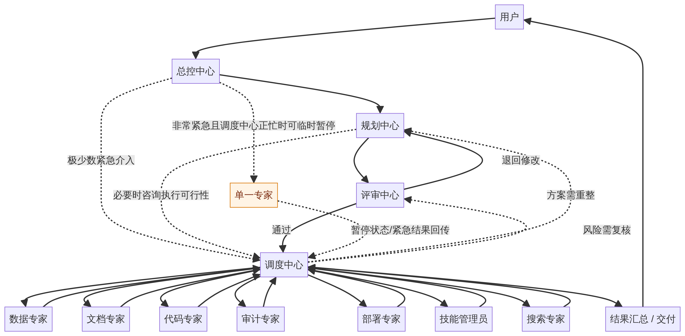
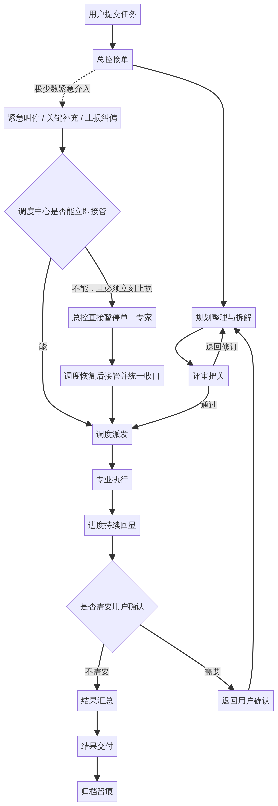

# Multi-Agent Orchestrator

> **中文简介：** 一套面向复杂任务协作的多智能体编排系统，强调**任务有入口、过程可见、结果可交付、历史可追溯**。[1][2][3]
>
> **English Description:** A governed multi-agent orchestration system for complex work, emphasizing visible progress, structured dispatch, and traceable delivery.[1][2][3]

本仓库的重点，不是把多个 Agent 简单堆成一个聊天窗口，而是把任务放进一条**用户能看懂、团队能治理、结果能回查**的流转链路中。[1][2] 对普通访客来说，可以把它理解为一个“会分单、会推进、会回显、会归档”的任务协作系统；对部署者来说，它则是一套可以继续产品化的公开工程底座。[1][3]

## 项目概述

当前版本已经完成公开仓库所需的脱敏、口径统一与主流程收口，保留了看板、前后端、角色配置、任务流转和文档治理入口，同时将较强的技术说明下沉到独立文档，避免主 README 继续承担过重的实现细节说明。[1][2][3]

| 维度 | 当前口径 |
| --- | --- |
| 默认界面语言 | **中文** |
| 对外主名称 | **Multi-Agent Orchestrator** |
| 主要使用方式 | 任务治理、调度派发、执行回显、结果归档 |
| 面向读者 | 公开访客、部署者、协作者、产品化改造者 |
| README 角色 | 只讲用户能理解的系统逻辑与阅读入口 |
| 技术说明位置 | 统一放入独立技术文档，不在 README 展开 |

## 用户视角：谁能调用谁

这张图只回答一个问题：**任务进入系统后，会先经过哪些治理角色，再被派给哪些执行角色，最后如何回到用户手里。** 它强调的是用户可理解的协作关系，而不是底层实现细节。[2][4]

在用户视角下，可以把系统理解成一条稳定主线：**总控中心负责接单，规划中心负责整理方案，评审中心负责把关，调度中心负责派活与收结果，专业角色负责真正执行。** 但现在也补充了一条**仅限非常紧急场景**的例外路径：如果任务已经在运行中，而用户发来紧急叫停、关键约束补充或需要立即止损纠偏的信息，总控中心会先优先通知调度中心；只有在**情况非常紧急、调度中心正忙且某个专家必须立刻停下**时，总控中心才可临时直达该单一执行角色，下达“立即暂停 / 等待进一步指令”的短指令，随后仍需回到正常治理链路补齐整理与复核。[2][4]

## 用户视角：任务怎么流转

这张图描述的是**从用户发起任务到最终交付与归档**的主流程。它不是技术架构图，而是站在使用者角度解释“任务为什么不会一提交就直接结束”。图中额外保留了一条紧急介入分支，用来表达总控中心只在极少数高时效、高风险情况下才会临时插入执行链路。[1][2]

下表概括了用户最容易感知到的几个关键阶段，便于快速理解系统的操作逻辑。

| 阶段 | 用户看到的表现 | 系统此时在做什么 |
| --- | --- | --- |
| 提交任务 | 填写标题与描述后发起任务 | 先收进统一入口，而不是立刻丢给某个执行角色 |
| 规划整理 | 任务进入处理中 | 整理目标、拆解步骤、判断是否需要多人协作 |
| 审核把关 | 任务可能短暂停留或回退 | 先检查方案是否完整、风险是否可接受 |
| 调度执行 | 进度开始持续变化 | 把任务派给合适的专业角色，并汇总回写 |
| 紧急介入（少数场景） | 任务运行中被临时叫停或收到关键修正 | 总控中心优先通知调度中心快速止损或同步硬约束；若调度中心正忙且必须立刻止损，才会临时直接暂停单一专家，随后回归主链路 |
| 用户确认 | 某些任务会停下来询问 | 涉及取舍、授权或方向分歧时返回给用户拍板 |
| 结果交付 | 看到结果、总结与历史 | 输出最终产物，并保留可追溯记录 |

## 最新界面预览

为了让访客在进入仓库后能快速理解当前公开界面的主入口，下面保留三张最新运行态预览图，分别对应**任务发布、技能管理、AI 搜索引擎**三个关键模块。[1]

其中，AI 搜索入口已经从早期的资讯订阅式界面收口为**纯粹的 Agent 驱动搜索工作台**：默认以低优先级进入调度链路，支持高级搜索设置，并允许在“自动分配”与“手动多选指定专家”之间切换，而搜索专家当前是否忙碌也会直接显示在页面中，便于判断是否适合立即发起持续搜索任务。[1][2]

| 模块 | 当前界面重点 | 运行态预览 |
| --- | --- | --- |
| 任务发布 | 作为统一任务入口，负责把需求送入治理链路 |  |
| 技能管理 | 面向技能配置、技能任务触发与过程查看 |  |
| AI 搜索引擎 | 面向 Agent 驱动搜索、低优先级任务发起、高级搜索设置与搜索专家状态查看 |  |

这些界面对应的公开口径已做过统一收口，兼容性内部字段不再作为默认展示文案直接暴露给最终用户；任务详情中的流程展示也已从固定模板逐步切换为**按真实任务流转动态生成**，搜索入口中的旧 RSS / 订阅式遗留项也已从默认公开界面移除。[1][2]

## 这个项目适合怎么理解

如果你是第一次来到这个仓库，最合适的理解方式不是把它当成“十几个 Agent 同时对话的演示页面”，而是把它看作一条**有治理节点的任务系统**。它强调的是：用户先发任务，系统先判断和整理，再审核，再调度执行，再交付，再归档，而不是跳过中间过程直接给一个不可追踪的结果。[1][2][3]

| 适合的用途 | 说明 |
| --- | --- |
| 架构与产品参考 | 用于理解任务治理、多角色协作、回退与归档机制 |
| 演示系统 | 用于展示复杂任务如何被拆解、分派与回显 |
| 二次开发底座 | 在公开版本基础上继续扩展角色、界面与行业流程 |
| 部署入口 | 作为部署阶段的公开起点文档 |

| 当前不强调的方向 | 原因 |
| --- | --- |
| 把 README 写成技术实现白皮书 | 技术说明已下沉到独立文档 |
| 把项目包装成一键全包安装器 | 当前更适合接入已有运行环境 |
| 让内部兼容 ID 直接成为对外文案 | 兼容字段只应停留在内部映射层 |

## 阅读入口

为了避免主 README 再次变成“用户说明、部署说明、技术设计、审计留痕”全部混在一起的文档，当前仓库把阅读入口做了分层。你可以按自己的角色选择合适的入口继续往下看。[2][3]

| 你想了解什么 | 推荐阅读 |
| --- | --- |
| 先快速看懂项目是做什么的 | 本 README |
| 想了解当前真实能力边界 | [`docs/current_capability_boundary.md`](docs/current_capability_boundary.md) |
| 想看技术架构、模块分层和处理链路 | [`docs/current_architecture_overview.md`](docs/current_architecture_overview.md) |
| 想了解路线与治理口径 | [`ROADMAP.md`](ROADMAP.md) |
| 想继续看阶段性归档与历史材料 | `docs/archive/`、`review_notes/archive_20260408/` |

## 目录速览

主目录仍然保持清晰分层，但 README 只保留用户能快速建立认知所需的高层说明，避免把实现细节直接堆在首页。[1][2][3]

| 路径 | 作用 |
| --- | --- |
| `dashboard/` | 看板与运行期交互入口 |
| `edict/backend/` | 后端服务与任务治理主逻辑 |
| `edict/frontend/` | 前端应用与界面实现 |
| `agents/` | 角色模板、职责设定与协作语义 |
| `docs/` | 补充文档、技术说明、归档与预览素材 |

## 部署提示

当前公开版更适合作为**可继续接入现有环境的工程底座**，而不是替你包办所有前置条件的一键安装包。更稳妥的方式是先阅读本 README 和能力边界说明，再结合你的现有环境决定采用最小变更路径。[1][3]

如果你是部署者，建议把技术细节阅读放到独立文档中完成，而不是依赖 README 首页做全部决策：

| 部署前建议先确认的事 | 对应文档 |
| --- | --- |
| 项目当前真实能做到什么 | `docs/current_capability_boundary.md` |
| 任务是怎么在系统里流转的 | `docs/current_architecture_overview.md` |
| 长期治理口径与后续路线 | `ROADMAP.md` |

## 版本日志

README 本轮已按“**主文档用户化、技术文档独立化**”的原则完成重构，保留用户能直接理解的关系图、任务流程图和界面预览，同时把较强的技术说明集中到独立文档中统一维护。[1][2][3]

| 日期 | 变更 |
| --- | --- |
| 2026-04-09 | 更新 AI 搜索引擎公开口径：改为 Agent 驱动搜索工作台，强调低优先级搜索任务、高级搜索设置、搜索专家忙闲状态，以及“自动分配 / 手动多选专家”互斥选择模式 |
| 2026-04-09 | 同步收口界面预览说明，移除公开文案中的 RSS / 订阅式旧看板遗留表述 |
| 2026-04-08 | 完成公开版脱敏、界面预览补充、主流程与治理口径收口 |
| 2026-04-08 | 补充用户视角的“谁能调用谁”简化关系图与“任务流程图”，并加入“调度中心正忙时总控可紧急暂停单一专家”的例外说明 |
| 2026-04-08 | 将技术性较强的架构说明下沉到 `docs/current_architecture_overview.md` |

## References

[1]: ./docs/current_capability_boundary.md "当前真实能力边界"
[2]: ./docs/current_architecture_overview.md "当前架构与处理逻辑总览"
[3]: ./ROADMAP.md "项目路线与治理入口"
[4]: ./agents.json "当前角色配置主文件"
