# Multi-Agent Orchestrator

> Final public snapshot of a task-centered multi-agent orchestration system.
> This repository is published as an archived, sanitized release rather than an actively maintained product.

Multi-Agent Orchestrator is a full-stack experiment in making multi-agent work visible, recoverable, and governable. It turns a request into a tracked task, routes that task through planning and specialist roles, exposes status in a web dashboard, and keeps enough history for review, continuation, and post-task reflection.

This final public version is released because the project reached a meaningful stage, but the surrounding tooling moved faster than this architecture could comfortably follow. The system can produce good results, and it can run in a target-mode style where work continues without constant manual steering. In practice, though, the orchestration overhead became too expensive: too many tokens, too much waiting, and too many recovery paths around stalled tool sessions. The project remains useful as a reference implementation and design record, but it is no longer the direction I would keep extending.

## Final Snapshot

This repository has been prepared for public release with runtime data removed. It is intended to show the architecture, interface, documents, scripts, and example workflow shape without exposing private task history or machine-specific state.

Included:

- Backend and frontend source for the orchestrator.
- Agent role definitions and registry specifications.
- Public documentation, diagrams, examples, and tests.
- Sanitized preview images for the final README.
- Install and service scripts as implementation references.

Excluded:

- Runtime databases, logs, ledgers, task workspaces, archives, snapshots, cache directories, process files, virtual environments, and dependency folders.
- Auth/session material, cookies, local credentials, API keys, and machine-specific paths.
- Private task outputs and internal release-preparation notes.

## What It Does

The system is built around a task lifecycle:

1. A user submits a task.
2. The task is normalized into a trackable work item.
3. Planning and dispatch roles decide how to route it.
4. Specialist agents work on the assigned parts.
5. The dashboard shows status, activity, risk, and handoff information.
6. Results and memory are retained so later work can continue from context.

The goal was not simply to put many agents in one chat. The goal was to make long-running agent work easier to inspect: who is handling the task, what stage it is in, where the working files are, whether it is stuck, and what can be resumed later.

## Preview Gallery

The images below are sanitized screenshots from the final public snapshot.

| Area | Preview |
| --- | --- |
| Ready screen |  |
| Task center | 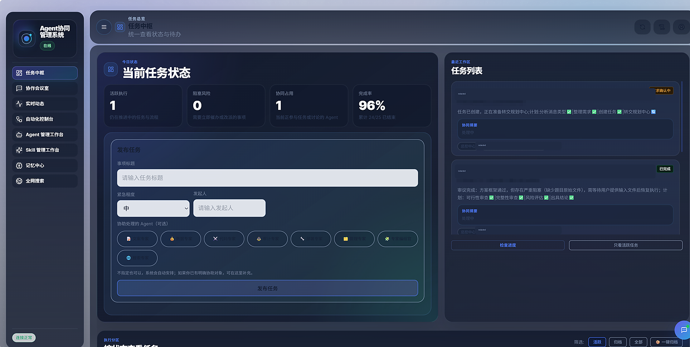 |
| Task detail and lifecycle | 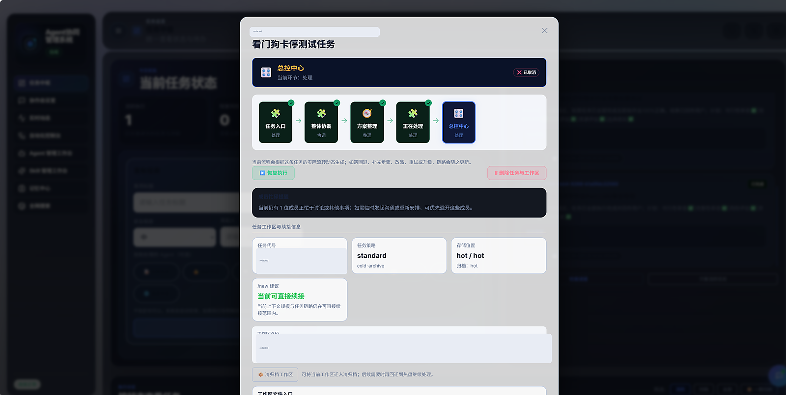 |
| Workspace and handoff panel | 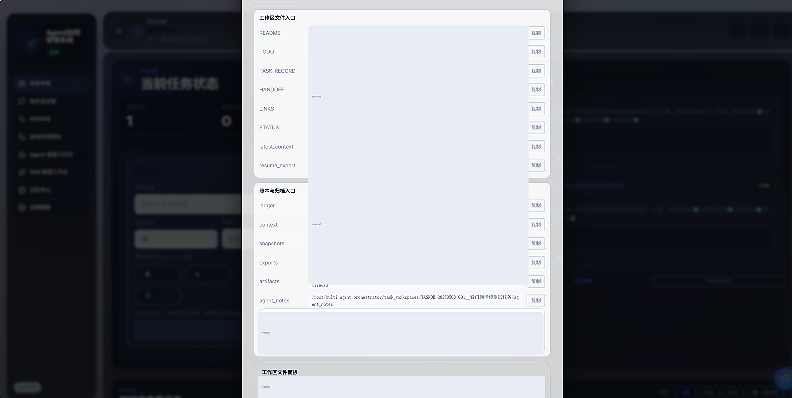 |
| Workspace files | 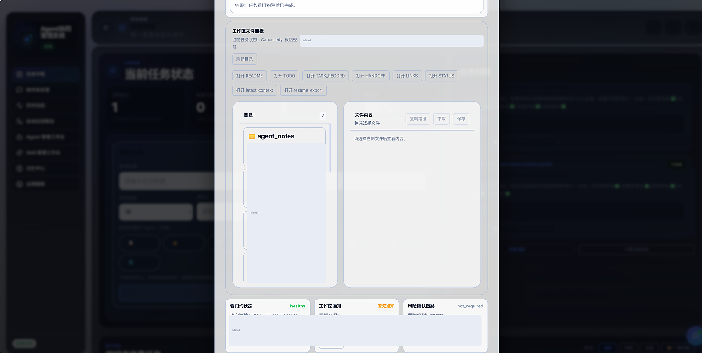 |
| Watchdog and recovery settings | 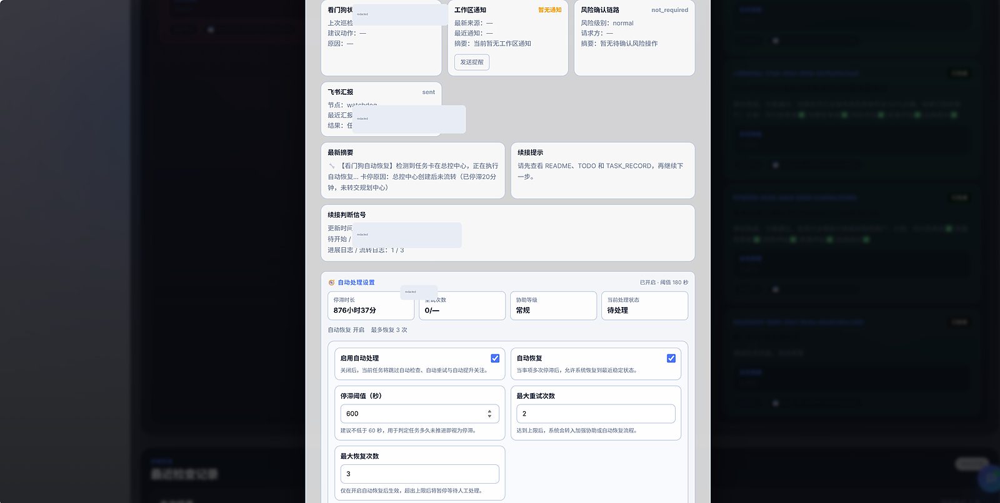 |
| Execution history | 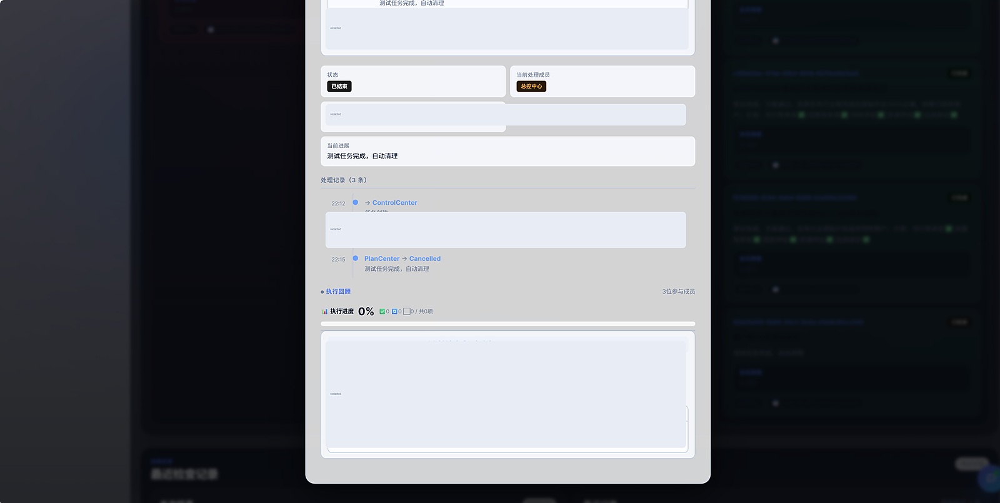 |
| Automation control center | 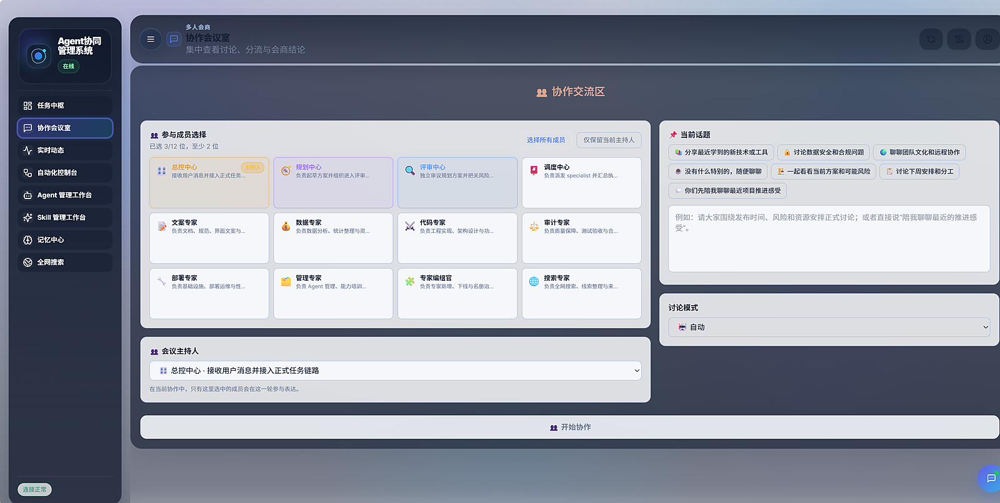 |
| Collaboration room | 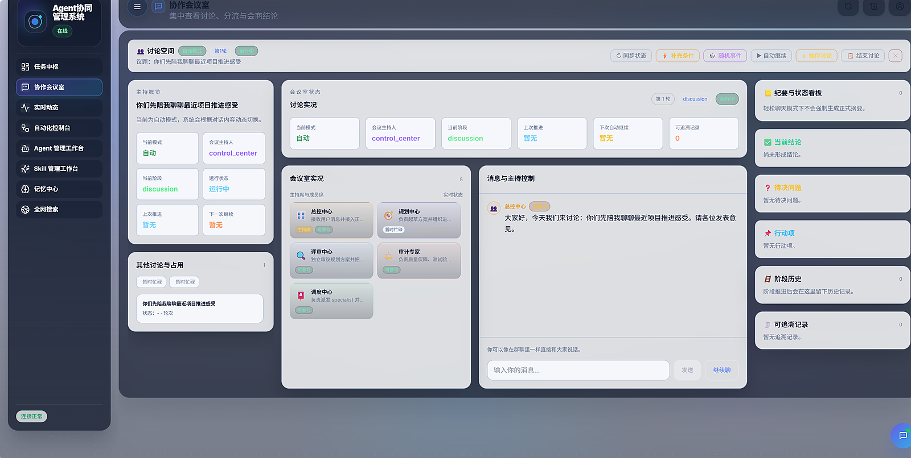 |
| Task kanban | 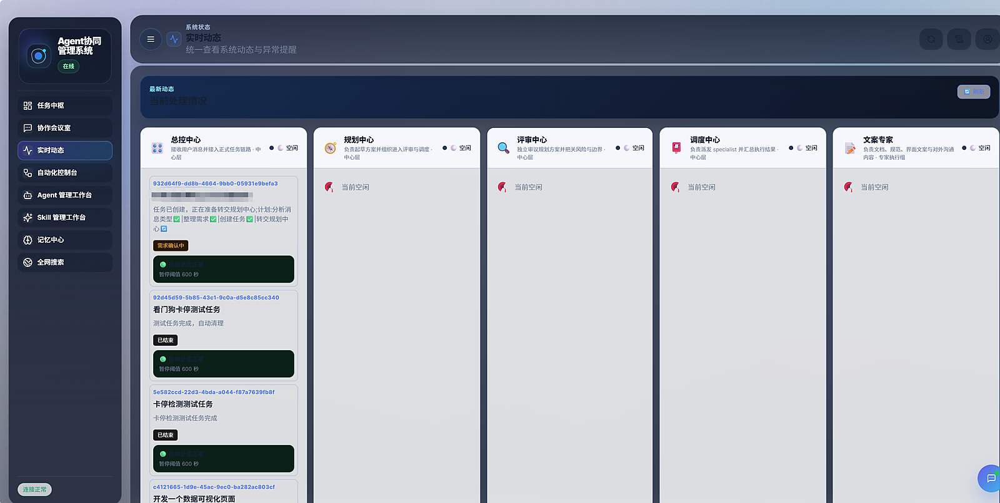 |
| System overview | 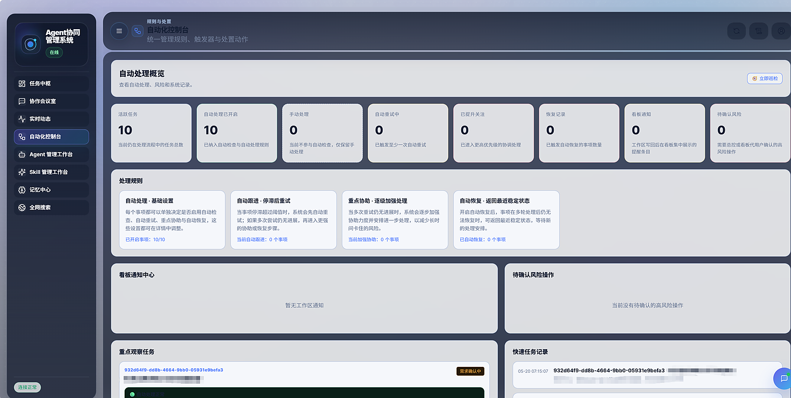 |
| Agent management workbench | 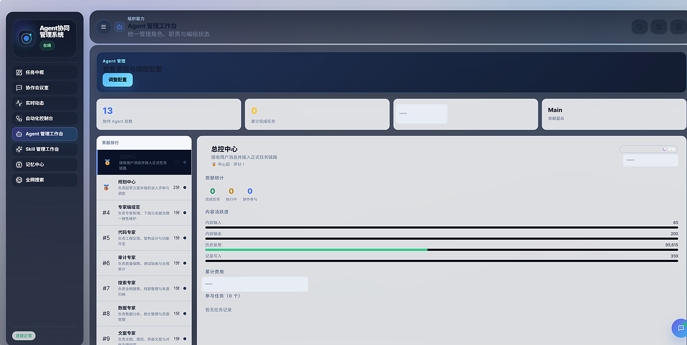 |
| Meeting discussion view | 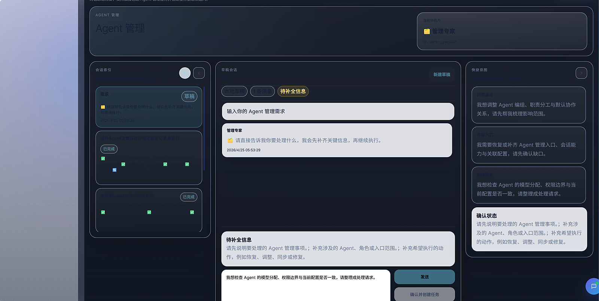 |
| Agent grid | 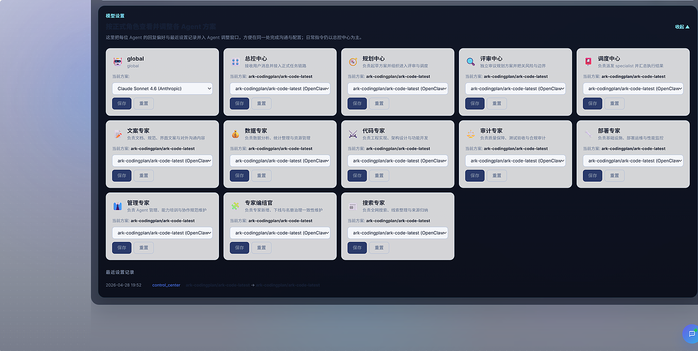 |
| Skill management | 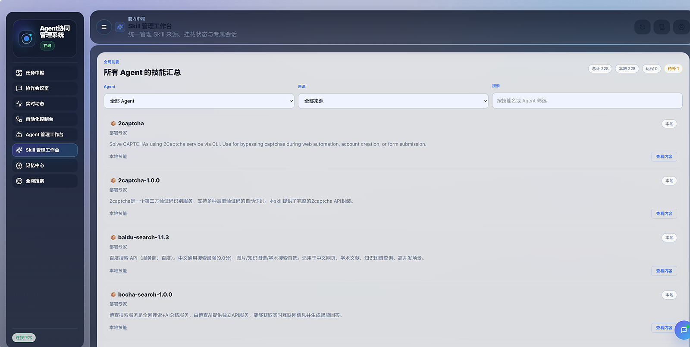 |
| Meeting room | 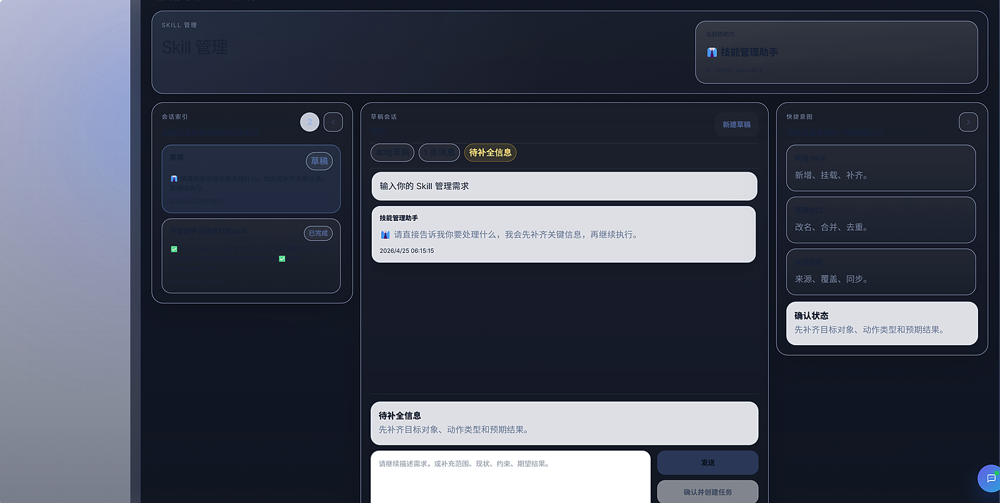 |
| Memory center list | 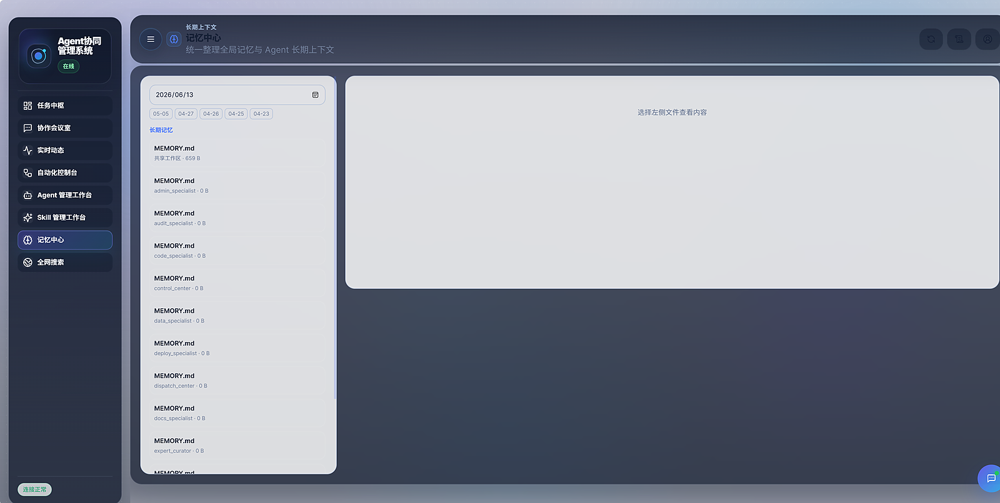 |
| Memory detail | 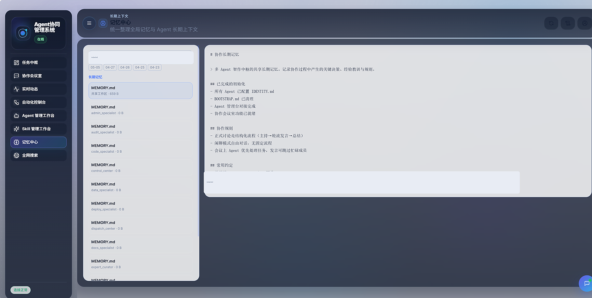 |
| Web search panel | 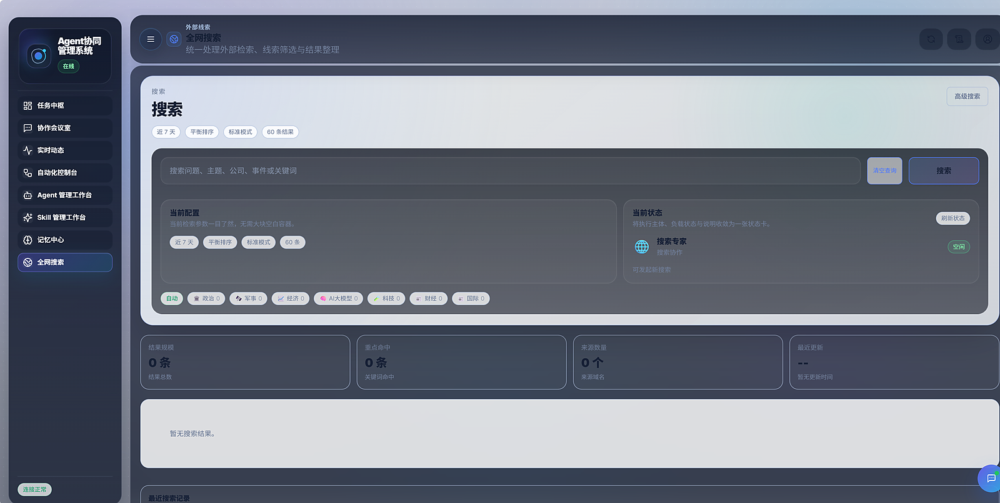 |

## Repository Map

| Path | Purpose |
| --- | --- |
| `agentorchestrator/backend` | FastAPI backend, task APIs, services, models, workers, and channel adapters. |
| `agentorchestrator/frontend` | React/Vite dashboard for task status, agent workbenches, memory, skills, search, and monitoring. |
| `agents` | Role prompts and operating contracts for coordination centers and specialists. |
| `registry` | Agent registry specs and generated role artifacts. |
| `scripts` | Operational helpers for task sync, config sync, refresh checks, and related workflows. |
| `docs` | Architecture notes, public reflections, diagrams, runbooks, and user-facing explanations. |
| `examples` | Example task patterns and sample use cases. |
| `tests` | Focused regression tests for synchronization, state-machine, file-lock, and kanban behavior. |

## Running Locally

This snapshot is best treated as a reference implementation. It may need adaptation before running on a fresh machine because the original system was tuned in a live environment.

Typical setup shape:

```bash
python -m venv .venv
source .venv/bin/activate
pip install -r requirements.txt
pip install -r agentorchestrator/backend/requirements.txt

cd agentorchestrator/frontend
npm install
npm run build
```

The included `install.sh`, `start.sh`, `uninstall.sh`, and `agentorchestrator.service` show the intended deployment shape. Review them before use, especially paths, ports, environment variables, and service-user assumptions.

## Why This Is Archived

This project was valuable, but it also proved a limit.

The architecture worked best when models needed more external structure: explicit roles, visible task state, watchdogs, recovery paths, and persistent memory. As tools and models improved, that same structure became heavier. Newer agent tools can often carry more context and execute more directly, while this system still pays the cost of routing, summarizing, reflecting, recording, and recovering each step.

The result was a system that could do impressive work, but often inefficiently. It consumed many tokens, spent a lot of time moving context through the orchestration pipeline, and was vulnerable to slowdowns when the underlying tool runner stalled. Stalled sessions could recover, but recovery meant waiting, checking state, and continuing through extra control logic. For real work, that made many tasks much slower than the quality of the final output would suggest.

So this repository is a final public snapshot: a record of the design, the working UI, the agent organization, and the lessons learned. The project is not abandoned because it failed to produce useful results. It is archived because the surrounding model and tool ecosystem moved past the architecture's efficiency envelope.

For the fuller reflection, see [Project Reflections](docs/project-reflections.md).

## Documentation

- [Getting Started](docs/getting-started.md)
- [Current Architecture Overview](docs/current_architecture_overview.md)
- [Technical Architecture](docs/technical-architecture.md)
- [User Guide](docs/user-guide.md)
- [Project Reflections](docs/project-reflections.md)
- [Architecture Reflection Notes](docs/architecture-reflection-notes.md)
- [Remote Skills Guide](docs/remote-skills-guide.md)
- [Security Policy](SECURITY.md)

## Security And Privacy

This public snapshot is sanitized. Do not commit local runtime state back into the repository. In particular, keep the following out of git:

- `.env` files, credentials, tokens, cookies, sessions, and API keys.
- `data`, `logs`, `ledger`, `context`, `task_workspaces`, `cold_task_archives`, `.pids`, `.venv`, `node_modules`, and frontend build output.
- Databases, SQLite WAL files, generated task archives, private workspaces, and machine-specific absolute paths.

## License

See [LICENSE](LICENSE).
