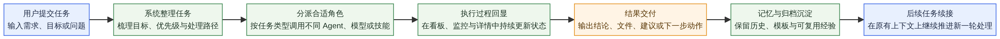

# Multi-Agent Orchestrator

> **中文简介：** 一套面向复杂任务协作的多智能体编排系统，重点不是“多几个 Agent 一起聊天”，而是把任务放进一条**可提交、可分派、可追踪、可交付、可回看**的工作流程中。[1] [2] [3] [5]
>
> **English Summary:** A multi-agent orchestration system designed for complex task delivery, with emphasis on **structured intake, visible execution, clear handoff, and recoverable history** rather than a simple multi-bot chat demo.[1] [2] [3] [5]

如果你想找的是一套能长期推进任务、而不是一次性对话结束就散掉的 Agent 系统，那么这个项目更接近你真正需要的形态。它把任务处理拆成用户能理解的几个阶段：先接收需求，再整理目标，然后分配合适的角色或能力继续执行，过程中持续回显状态，最后沉淀结果与历史，方便后续追踪、复盘和继续处理。[1] [2] [3]

当前公开版已经提供任务看板、运行监控、任务详情、模型配置、技能配置、Agent 管理工作台、协作会话、记忆中心、模板中心、AI 搜索引擎与协同讨论等可视化入口，重点是让用户能从界面上直接看懂“任务现在到哪一步、谁在处理、结果放在哪里、之后还能不能继续接着做”。[1] [4] [5]

## 一眼看懂界面

如果你第一次打开这个仓库，最有帮助的不是先看实现细节，而是先看系统界面到底如何承载一条任务。下面这组首页预览图，分别对应任务总览、单任务追踪、角色协作与历史沉淀四个最关键的用户感知层面。[1] [4] [5]

| 界面预览 | 用户能直接理解的内容 |
| --- | --- |
|  | **任务看板总览**用于快速判断当前任务池的状态分布、优先级和处理节奏，帮助用户先看清全局再进入具体任务。[1] [4] |
|  | **任务详情视图**用于追踪单个任务的背景、当前状态、过程摘要和结果线索，减少反复翻找上下文的成本。[1] [4] |
|  | **Agent 管理工作台**用于理解不同角色如何分组、协作和接力，让执行过程不再是黑盒。[1] [4] |
|  | **记忆中心**用于沉淀历史任务、长期记忆和可复用经验，方便后续继续推进同类工作。[1] [4] [5] |

这些界面放在一起，表达的并不是“页面很多”，而是这套系统把**看全局、查细节、管协作、留历史**放进了一条连续的用户路径里。[1] [2] [4]

## 基础流程图

如果要用一张图去解释这套系统最基本的工作方式，那么它可以被概括为：**任务进入系统后先被整理，再被分派执行，过程中持续回显状态，最后完成交付并沉淀为可续接的历史。** 这也是为什么首页除了讲功能介绍，还需要把“它是怎么运转的”直接展示出来。[1] [2] [3] [5]

| 流程节点 | 用户视角下的含义 |
| --- | --- |
| 提交任务 | 你把问题、目标或需求正式送进系统，形成可追踪的任务入口。[1] [2] |
| 整理任务 | 系统先把零散描述转成更清晰的目标、步骤与优先级，避免任务一开始就混乱。[2] [3] |
| 分派角色 | 任务会交给更合适的角色、模型或技能组合处理，而不是由单一窗口硬撑到底。[1] [3] [4] |
| 过程回显 | 你可以在看板、监控与详情中看到任务如何推进，而不是只能等待最终结果。[1] [4] |
| 结果交付 | 系统输出结果、建议、文件或下一步动作，方便立即使用或继续衔接。[2] [5] |
| 记忆沉淀 | 任务结束后，历史、模板和经验会被保留下来，为下一轮处理提供基础。[1] [4] [5] |

## 这套系统适合解决什么问题

很多团队在使用 Agent 时真正遇到的问题，并不是“模型不够多”，而是任务一旦变复杂，就容易出现入口分散、过程不可见、责任不清、结果难追、历史难续的问题。这个项目的意义，在于把这些问题收束到同一条任务主线里，让协作更像一个稳定运转的工作系统，而不是临时性的聊天实验。[1] [2] [3]

| 使用场景 | 用户通常遇到的问题 | 这套系统提供的帮助 |
| --- | --- | --- |
| 复杂任务协作 | 事情涉及多步骤、多角色，单一聊天窗口很难持续推进 | 通过统一任务入口与分工机制，把任务拆开并持续推进 [1] [2] |
| 需要过程透明 | 任务发出去之后不知道谁在做、做到哪一步 | 可以在看板、监控和详情中看到状态与进展 [1] [4] |
| 需要复盘与追溯 | 任务完成后难以回看处理路径和关键结果 | 系统会保留任务历史、过程记录与后续续接基础 [2] [5] |
| 需要长期沉淀 | 历史任务越来越多，当前工作容易被打断 | 通过记忆、归档与恢复机制把当前处理和历史沉淀分开 [2] [5] |

## 你可以把它理解成什么

从用户角度看，这不是一个“功能很多”的后台页面，而是一套**围绕任务生命周期设计的协作系统**。它更像是把项目经理、调度员、执行角色、复核者和知识沉淀区放进同一个界面里，让你既能发起任务，也能看清楚任务如何一步步走向结果。[1] [2] [3]

| 你在界面里看到的内容 | 对应的用户意义 |
| --- | --- |
| 任务看板与监控 | 快速判断当前有哪些任务、哪些正在推进、哪些需要关注 [1] [4] |
| 任务详情与过程记录 | 了解任务背景、当前状态、处理建议与结果线索 [1] [2] |
| Agent 管理工作台 | 看见不同角色的职责、分组与协作关系 [4] |
| 模型配置与技能配置 | 调整不同角色背后的能力组合，适配不同任务类型 [1] [4] |
| 协作会话与快速任务 | 处理需要临时沟通、快速推进或短链路执行的事项 [1] [4] |
| 记忆中心与模板中心 | 复用经验、保留知识、沉淀标准做法 [1] [4] [5] |
| AI 搜索与协同讨论 | 为复杂任务补充外部信息与讨论视角 [1] [4] |

## 一条任务是怎么跑起来的

这套系统最核心的基础逻辑，可以概括成一句话：**接收任务，整理目标，分派执行，持续回显，交付结果，沉淀历史**。[1] [2] [3] [5] 这也是首页最应该让用户先理解的部分。

| 阶段 | 用户会感受到什么 | 系统在背后完成什么 |
| --- | --- | --- |
| 提交任务 | 把需求、目标或问题送进系统 | 建立任务入口并形成统一处理对象 [1] [2] |
| 整理任务 | 任务开始被结构化，不再只是零散描述 | 梳理目标、步骤、优先级和后续处理方向 [2] [3] |
| 分派执行 | 不同角色开始接手不同部分 | 把任务交给更合适的角色、模型或能力模块 [1] [3] [4] |
| 过程回显 | 你能看到任务状态、过程摘要和关键变化 | 持续更新任务看板、详情与监控信息 [1] [4] |
| 结果交付 | 获得结果、摘要和后续动作建议 | 汇总产出并准备交付或进入下一轮处理 [2] [5] |
| 历史沉淀 | 任务做完后仍然可以回看、复用或继续推进 | 保留记忆、归档信息与恢复入口 [2] [5] |

对于短平快的小事，系统也并不要求所有任务都走最重的流程。公开版已经区分标准任务与更轻量的任务处理方式，目标是让治理强度与任务复杂度相匹配，而不是为了“流程完整”牺牲使用体验。[2] [5]

## 核心功能应该怎么理解

如果只从“功能列表”去看这个项目，容易觉得它模块很多；但从用户体验去看，这些模块其实服务的是同一件事：**让任务更容易被发起，更稳定地推进，更清楚地回看，更自然地延续**。[1] [2] [4]

| 功能模块 | 作用说明 | 为什么对用户有价值 |
| --- | --- | --- |
| 任务看板 | 集中展示任务总览与状态变化 | 不必翻聊天记录，也能快速判断全局 [1] [4] |
| 运行监控 | 观察处理节奏、异常和关键动态 | 更早发现卡点，避免任务悄悄失控 [1] [4] [5] |
| 任务详情 | 查看任务背景、状态、建议与结果线索 | 进入单个任务时不需要重新猜上下文 [1] [2] |
| Agent 管理工作台 | 管理角色分组、职责和协作关系 | 让分工逻辑清晰，而不是黑盒执行 [4] |
| 模型与技能配置 | 为不同角色配置更合适的能力组合 | 同一系统能适配不同任务难度与风格 [1] [4] |
| 记忆中心 | 沉淀长期信息与历史结果 | 有助于后续复用、延续与知识积累 [1] [4] [5] |
| 模板中心 | 复用常见任务模板与标准输入 | 提高发起任务的效率与一致性 [1] [4] |
| AI 搜索引擎 | 为任务补充外部资料与信息线索 | 适合研究型、对比型和资料型工作 [1] [4] |
| 协同讨论视图 | 用于展示多角色协作与讨论过程 | 让团队更容易理解协同关系与决策路径 [1] [4] |

## 为什么首页要先讲这些，而不是先讲技术实现

对大多数第一次接触这个仓库的人来说，最重要的问题通常不是“后端怎么组织”或“状态怎么落盘”，而是三件更直接的事情：**它到底能帮我做什么、我该怎么理解它、我应该从哪里开始使用**。因此，首页更适合先站在用户视角说明价值和使用逻辑，而把更细的实现机制留给专门的文档去展开。[1] [2] [3]

如果你关心的是使用逻辑，建议先阅读用户文档；如果你想快速看界面效果，可以直接看截图目录说明；如果你后续需要研究底层结构、任务治理与实现方式，再进入技术文档会更顺手。[1] [3] [4]

| 阅读目标 | 建议先看哪里 | 适合谁 |
| --- | --- | --- |
| 先判断这套系统是不是自己需要的 | [用户文档](./docs/user-guide.md) | 使用者、产品负责人、协作者 [1] |
| 先快速看当前界面与模块分布 | [截图说明](./docs/screenshots/README.md) | 第一次浏览仓库的人 [4] |
| 了解当前架构和任务处理逻辑 | [当前架构总览](./docs/current_architecture_overview.md) | 需要理解整体设计的人 [3] |
| 深入研究实现方式 | [技术文档](./docs/technical-architecture.md) | 开发者、维护者 [2] |

## 一个更简单的结论

如果要用一句更接近用户语言的话来概括这个项目，那么它可以被理解为：**一套让复杂任务真正“有人接、有人分、有人做、有人看、做完还能继续接着做”的多智能体协作系统**。[1] [2] [3] [5]

它的价值不在于把多少模型放在一起，而在于把“任务”本身变成一个可管理、可观察、可交付、可延续的对象。这也是首页现在更应该讲清楚的基础逻辑。[1] [2] [3]

## 开源来源与致谢

当前公开版基于已有开源工作继续整理与扩展，并在公开发布过程中完成命名收口、文档重写、工作流治理补强与界面梳理。这里保留对上游项目的简要致谢，方便读者理解公开版的来源关系。[6] [7]

| 项目 | 说明 |
| --- | --- |
| [cft0808/agentorchestrator](https://github.com/cft0808/agentorchestrator) | 当前公开版整理所参考的上游之一 [6] |
| [wanikua/danghuangshang](https://github.com/wanikua/danghuangshang) | 当前公开版整理所参考的上游之一 [7] |

## Version Log / 版本日志

| Date / 日期 | Change / 变更 |
| --- | --- |
| 2026-04-11 | Added a homepage interface showcase and a simplified task flow diagram so first-time visitors can understand the product from screens and flow before reading implementation details / 为首页补充界面展示区与简化任务流程图，让初次访问者先从界面和流程理解产品，再进入实现细节 [1] [2] [3] [4] [5] |
| 2026-04-11 | Rewrote the homepage README into a more user-oriented entry, reduced implementation-heavy wording, and clarified product positioning, feature value, and the basic task flow logic / 将首页 README 改写为更用户导向的版本，弱化实现细节，强化产品定位、功能价值与任务基础逻辑说明 [1] [2] [3] [4] [5] |
| 2026-04-09 | Rewrote the homepage README into a bilingual Chinese-English entry, updated project positioning, added user and technical documentation links, and integrated new governance flow diagrams / 将首页 README 重写为中英文双语入口，更新项目定位，加入用户文档与技术文档入口，并整合新的治理流程图 [1] [2] [3] [4] |
| 2026-04-09 | Documented task workspace, file ledger, cold/hot tiering, archive reactivation, `/new` rule, watchdog, Feishu reporting, and frontend governance entries / 同步纳入任务工作区、文件化账本、冷热分层、归档回迁、`/new` 规则、看门狗、飞书汇报与前端治理入口 [2] [3] [5] |
| 2026-04-10 | Added README table of contents, clarified watchdog-supervised `/new` and risk confirmation governance, and restored concise upstream attribution references required by the public MIT release / 补充首页目录，明确看门狗监督式 `/new` 与风险确认治理，并恢复公开版 MIT 所需的简短上游来源引用 [2] [6] [7] |
| 2026-04-08 | Completed major public-release cleanup, naming convergence, and dashboard preview consolidation / 完成公开版主线脱敏、命名收口与界面预览整理 [1] [3] |

## References

[1]: ./docs/user-guide.md "用户文档"
[2]: ./docs/technical-architecture.md "技术文档"
[3]: ./docs/current_architecture_overview.md "当前架构与处理逻辑总览"
[4]: ./docs/screenshots/README.md "截图说明"
[5]: ./agentorchestrator/scripts/e2e_task_workspace_validation.py "E2E 联调脚本入口"
[6]: https://github.com/cft0808/agentorchestrator "cft0808/agentorchestrator"
[7]: https://github.com/wanikua/danghuangshang "wanikua/danghuangshang"
