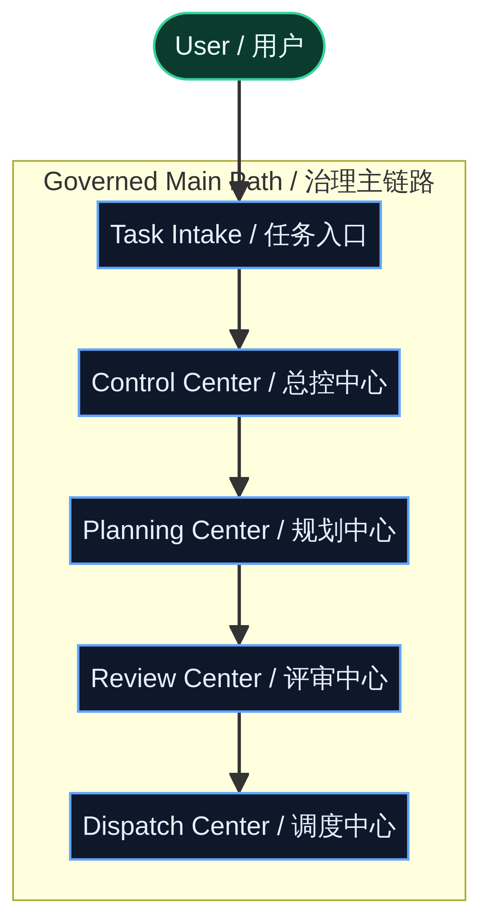
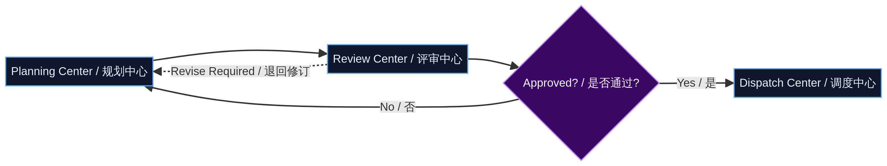
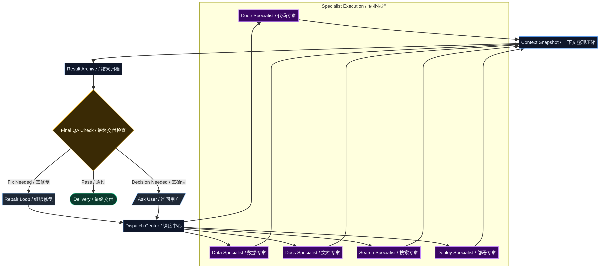
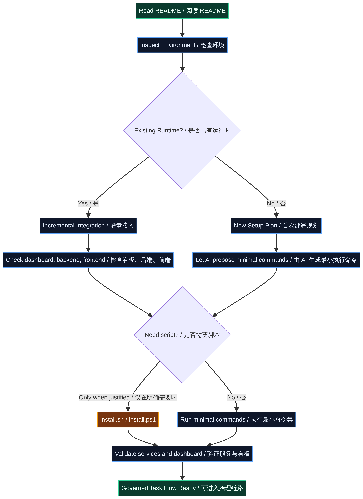
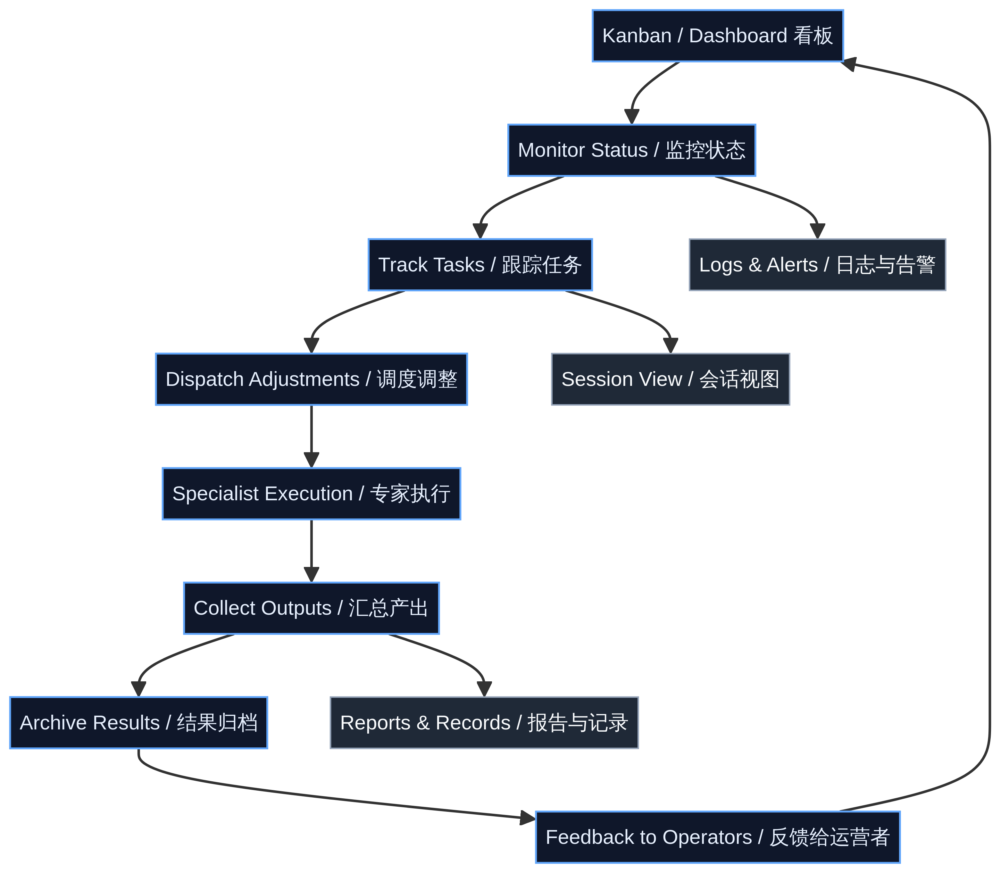

# Multi-Agent Orchestrator

> **中文简介：一个默认以中文部署、中文运行为主，并面向复杂任务治理场景设计的多智能体协作编排系统。**
>
> **English Description: A public, deployment-ready multi-agent orchestration repository with Chinese as the default operating language and English as an available companion language.**
>
> This repository is designed for governed task execution rather than loose multi-agent chatting. It emphasizes **observable workflow stages, role-based coordination, dashboard visibility, reusable agent templates, and clean public-release boundaries**. In Chinese, this can also be summarized as **一个强调任务分阶段治理、执行可观测、结果可归档、角色模板可替换、看板可持续扩展的公开协作编排仓库**.

## Project Overview

**Multi-Agent Orchestrator** is a production-oriented orchestration framework for complex tasks. Its Chinese counterpart can be summarized as **一个把复杂任务纳入可治理、可观测、可审查、可归档执行链路的多智能体协作编排框架**. Instead of placing multiple agents into a single undifferentiated conversation, it routes work through a structured pipeline that includes **task intake, central preprocessing, planning, review, dispatch, specialist execution, and result archiving**. This makes the system easier to monitor, intervene in, audit, and extend.

This public repository has been prepared as a **sanitized release**. It keeps the dashboard, backend, frontend, agent templates, and deployment-facing documentation, while removing private environment material, local runtime traces, sensitive review artifacts, and other content that should not be exposed in a public repository.

| Dimension | Current public-release policy |
| --- | --- |
| Public repository name | **multi-agent-orchestrator** |
| Default deployment language | **Chinese** |
| Dashboard language | Chinese by default, English available |
| Agent template strategy | Chinese-first templates, English deployment guide available |
| Public release requirement | Keep the MIT License and attribution notes; never commit sensitive data |
| Docker support policy | **Docker images, container orchestration, and related maintenance are not provided** |

## Project Workflow Diagrams

Because a single long workflow image becomes **too thin, too tall, and difficult to read** once it is embedded into a GitHub README, and because even a partially split diagram can still feel crowded if governance, review loops, dispatch fan-out, and archive convergence are all forced into one frame, this repository now uses **five shorter workflow diagrams**. The reading order is intentionally progressive: readers first understand the governed intake path, then the review loop, then execution convergence, then deployment, and finally the dashboard runtime loop.

### 1. Governed Intake Path

This diagram keeps only the main path from user input to the point where work becomes dispatchable. It helps readers see the governance skeleton first: tasks do not go directly to a specialist, but pass through a unified intake, a control layer, planning, and review before they can enter supervised dispatch.



> This diagram answers one core question: **how work enters the governed system and advances to a dispatch-ready state**.[1]

### 2. Review Loop and Release Decision

This diagram isolates the relationship between the Planning Center and the Review Center. By separating approval, revision, and release logic from the main path, the README avoids stacking return arrows on top of the primary governance flow and becomes easier to read.



> This diagram answers the question: **how planning output is reviewed, how rejected work is sent back for revision, and how approved work proceeds to dispatch**.[1]

### 3. Dispatch, Specialist Execution, and Result Convergence

This diagram focuses only on how the Dispatch Center fans work out to multiple specialists and then converges the resulting outputs through **context snapshotting and compression**, result archiving, a final delivery check, and final delivery. It now makes two previously missing controls explicit. First, **long-running or multi-stage work must not rely only on transient context; it should be condensed into a stable, re-readable summary before entering the delivery path.** Second, **outputs must not be declared complete immediately after archiving; they must first pass a final delivery check. If the check fails, the flow returns to the repair loop, and if a trade-off cannot be decided autonomously, the flow returns to the user for confirmation before continuing.** Once the pre-dispatch governance stages are removed from the same frame, the fan-out, context convergence, acceptance gate, and delivery convergence pattern become much easier to recognize.



> This diagram answers the question: **how the Dispatch Center coordinates multiple specialists and, after context snapshotting, result archiving, final checking, repair routing, and user confirmation, converges outputs into one governed delivery path**.[1]

### 4. Deployment and Verification Flow

This diagram explains the recommended public deployment path. The key idea is that operators should **read the README, inspect the environment, determine whether an existing runtime is already present, and let AI plan the minimal execution path** before deciding whether any installation script is needed.



> The recommended sequence is **Read the documentation → Inspect the environment → Decide between incremental integration and new setup → Let AI propose the minimal commands → Use scripts only when justified → Validate services and dashboard → Enter the governed workflow**.

### 5. Dashboard Runtime and Feedback Flow

This diagram explains what happens after deployment. It focuses on how operators use the dashboard to observe system status, track tasks, adjust dispatching, inspect sessions and logs, and turn outputs into reports and archived results. In other words, it represents the system’s **runtime observability and operational feedback loop**.



> The runtime loop centers on **monitoring status, tracking tasks, adjusting dispatch, supporting specialist execution, collecting outputs, archiving results, and feeding visibility back to operators**, with logs, session views, and reports providing supporting context.

The table below summarizes why the README now uses five separate diagrams.

| Diagram | Main question it answers | Best first readers |
| --- | --- | --- |
| Governed Intake Path | How the system admits work into a governed pipeline and advances it to a dispatch-ready state | First-time visitors, architecture reviewers |
| Review Loop and Release Decision | How plans are reviewed, revised, and approved before dispatch | Architecture reviewers, process designers |
| Dispatch, Specialist Execution, and Result Convergence | How specialist branches are dispatched and gathered back into one final output path | Specialist designers, secondary developers |
| Deployment and Verification Flow | Why deployment should start with AI-assisted environment inspection instead of blind script execution | Deployers, operators |
| Dashboard Runtime and Feedback Flow | How the dashboard supports monitoring, dispatch, observability, and archival after deployment | Daily operators, secondary developers |

> Together, these five diagrams form the public repository’s intended reading path: **understand the governed intake path first, then the review loop and execution convergence, then the deployment path, and finally the runtime operating loop**.[1]

## Main Guidance for Deployment-Stage AI

If this repository is being deployed with the help of an AI system, **treat `README.md` as the highest-priority deployment document**. The Chinese README is the authoritative operational entry point because this repository is intentionally deployed and run in Chinese by default.

The English README is provided to help external readers, collaborators, and international reviewers understand the repository boundaries. It should not override the Chinese-first deployment policy.

### Core deployment rules

| Rule | Explanation |
| --- | --- |
| Chinese remains the default | Do not switch the whole public system to English unless the deployer explicitly requests it |
| Public UI must use the formal center / specialist naming system | Legacy role names and historic labels must not appear in the default interface |
| AI-assisted deployment comes first | Let deployment-stage AI inspect the environment, plan commands, and flag risks before choosing an execution path |
| Installation scripts are execution tools, not the primary narrative | Keep `install.sh` and `install.ps1`, but present them as callable entry points after the AI has assessed the environment |
| Dashboard verification comes first | Deployment should validate the dashboard, task flow, state visibility, and archive views before claiming success |
| Docker is out of scope | Do not treat Dockerfiles, container manifests, or legacy image notes as a supported deployment path |
| English support is additive | English is an optional companion layer, not a replacement for the default Chinese deployment |
| Agent templates stay Chinese-first | If English prompts are needed, generate them as deployment supplements instead of replacing the Chinese originals |

## Public Positioning

This repository is not just a mock interface. It is intended to remain a **workable base project** for public demonstration, internal adaptation, secondary development, and AI-assisted deployment. It can be used to study architecture, run a demonstration system, extend a governed workflow platform, or serve as a structured starting point for more specialized orchestration products.

| Use case | Description |
| --- | --- |
| Architecture reference | Study staged task governance and role-based orchestration |
| Demo system | Present task flow, monitoring, and archive capabilities |
| Secondary development base | Extend the public repository into a domain-specific system |
| AI deployment entry | Give an AI a reliable, structured understanding of repository boundaries |

## Public Repository Information and Collaboration Entry

To help public visitors, deployment-stage AI, and future contributors keep the same mental model, this repository should be treated as a **public-release, production-style orchestration foundation** with explicit upstream attribution, rather than as a one-off demo package.

| Repository metadata | Current public wording |
| --- | --- |
| Repository name | `multi-agent-orchestrator` |
| Display title | **Multi-Agent Orchestrator** |
| Short repository description | A production-style multi-agent orchestration system for governed task execution, dispatch, execution visibility, and dashboard-based operations |
| Default public language | Chinese-first, with English as a switchable companion layer |
| Author | **JiangNanGenius** |
| License | **MIT License** |

If you plan to keep maintaining this repository publicly, it is recommended to keep the GitHub About text, README positioning, repository topics, and release notes aligned so that the repository homepage and its main documentation do not drift apart again.

| Public collaboration entry | Current recommendation |
| --- | --- |
| Issues | Use the current public repository issue tracker as the central place for problem reports |
| Security Advisories | Use GitHub private security reporting for vulnerability disclosure |
| Pull Requests | Follow the standard fork + feature branch workflow |
| Public-facing documentation updates | Keep README files, `CONTRIBUTING.md`, and `SECURITY.md` aligned |

### What this repository is not optimized for

| Scenario | Why it is not the default fit |
| --- | --- |
| Expecting a one-command full OpenClaw production installation from scratch | This public repository assumes you already have a basically usable OpenClaw runtime |
| Expecting officially maintained Docker, Compose, or Kubernetes delivery flows | Containerization is not the current public delivery story for this repository |
| Expecting English-first UI and English SOUL as the primary shipped baseline | The default deployment experience remains Chinese-first, with English as a companion layer |
| Expecting internal logs, runtime snapshots, or real operational data to be published directly | Public release boundaries require continuous sanitization before publishing |
| Expecting legacy compatibility fields to become the final public UI wording | Compatibility values belong in mapping layers, not in the default public presentation |

> **Recommended framing:** treat this repository as a public, productizable orchestration foundation that attaches to an existing environment, not as an all-in-one runtime bootstrap package.

## Default Architecture Terminology

This public release uses a **modern Chinese architecture vocabulary** for default user-facing behavior. Historical aliases may still exist internally for compatibility with legacy data, older task records, or mapping logic, but such aliases must not be shown as the default public wording.

| Workflow stage | Public-facing default label | Description |
| --- | --- | --- |
| Task intake | 任务入口 | Receives and records incoming work |
| Central preprocessing | 总控中心 | Organizes, triages, and advances tasks |
| Planning | 规划中心 | Decomposes tasks and proposes execution plans |
| Review | 评审中心 | Checks feasibility, risk, and quality |
| Dispatch | 调度中心 | Assigns specialist work and supervises progress |
| Specialist execution | 专业执行组 / 专家节点 | Performs concrete execution work |
| Result retention | 结果报告 / 结果归档 | Aggregates outputs and preserves traceable results |

## Repository Structure

```text
multi-agent-orchestrator/
├── README.md
├── README_EN.md
├── README_JA.md
├── LICENSE
├── CONTRIBUTING.md
├── SECURITY.md
├── PUBLIC_REPO_METADATA.md
├── agents/
├── dashboard/
├── docs/
└── edict/
```

The source tree keeps several historical directory names for engineering continuity, including `edict/backend/` and `edict/frontend/`. These are **path names inside the repository**, not the public-facing product name.

| Path | Purpose | Current expectation |
| --- | --- | --- |
| `dashboard/` | Public dashboard entry, archive view, and runtime surfaces | Chinese default, English support available |
| `edict/backend/` | Backend services, task models, orchestration logic | Deployment-oriented backend code |
| `edict/frontend/` | Frontend source and build project | Source of the dashboard UI and static build |
| `agents/` | Agent templates and role instructions | Chinese-first semantic layer |
| `docs/` | Supplementary deployment and architecture documents | Public-facing support materials |

## Deployment Guide

This section assumes that **your OpenClaw environment is already basically usable**. In other words, OpenClaw can already start, model credentials can already be configured, and your environment already has the minimum capability required to run agents. Under that assumption, this repository is not primarily about installing OpenClaw from scratch. The real deployment task is to connect this project’s **dashboard, backend, frontend, SOUL assets, and synchronization scripts** to an existing OpenClaw runtime.

> **Current boundary:** this project **does not provide or maintain Docker images, `docker-compose` workflows, or containerized deployment support**. If Docker-related files still exist in the repository, treat them as historical leftovers rather than the recommended deployment path.

### 1. Clone the repository

```bash
git clone https://github.com/JiangNanGenius/multi-agent-orchestrator.git
cd multi-agent-orchestrator
```

### 2. Verify that the repository structure is complete

Before continuing, it is worth confirming that the public release includes all expected top-level directories. This reduces the chance of discovering missing build artifacts or incomplete role materials only after the installation process has already started.

```bash
ls dashboard
ls edict
ls agents
ls docs
```

| Directory | Purpose | What to verify during deployment |
| --- | --- | --- |
| `dashboard/` | Main public-facing entry after deployment | Whether it serves the latest built frontend assets |
| `edict/backend/` | Backend services and task APIs | Whether task, scheduler, and agent data can be loaded correctly |
| `edict/frontend/` | React frontend source | Whether the UI can be built successfully |
| `agents/` | SOUL files, GLOBAL content, and group rules | Whether they can be synchronized into the OpenClaw workspaces |
| `docs/` | Supplemental notes and progress records | Whether any public-facing documentation still needs cleanup |

### 3. Recommended path: let AI assess the environment first, then choose the minimal execution path

If OpenClaw is already available in your environment, the **first-choice deployment path** is not to immediately run a repository script by hand. Instead, provide this README, the repository structure, and the current runtime status to a deployment-stage AI so it can determine whether the situation is a first-time attachment or an incremental update, and then choose the smallest safe set of actions.

Before any command is executed, the AI should evaluate the following points:

| Checkpoint | What to confirm |
| --- | --- |
| Environment health | Whether OpenClaw starts correctly, models are configured, and existing workspaces are usable |
| Deployment type | Whether this is a first-time repository attachment or only a frontend / SOUL / config / data refresh |
| Risk surface | Whether there are stale workspaces, outdated symlinks, older agent registrations, or unfinished builds |
| Execution entry | Whether a one-shot initialization script is appropriate or whether the incremental command path is safer |

After that assessment is complete, only run a repository-level initialization script when the AI concludes that a one-shot setup is the right path for the current environment. In all other cases, prefer the incremental deployment path and avoid treating repository scripts as either the default entry or the primary deployment story.

When the AI explicitly recommends a one-shot initialization, `install.sh` or `install.ps1` can be used as conditional execution tools for that environment. They are retained for first-time attachment scenarios and similar clean-slate setups, not presented as the standard starting point for routine deployment or updates.

| Step | Effect |
| --- | --- |
| Create or complete workspaces | Prepares runtime directories for each agent |
| Register agents | Makes the repository roles visible to the current OpenClaw environment |
| Initialize data | Prepares the baseline files required by the dashboard and runtime views |
| Create shared links | Connects shared resources such as `data/` and `scripts/` into workspaces |
| Synchronize credentials | Copies already configured model credentials to other agents |
| Build the frontend | Installs frontend dependencies and builds the UI inside `edict/frontend/` |
| Run initial synchronization | Generates agent configuration, statistics, and dashboard data |
| Restart the gateway | Reloads the runtime so the new configuration can take effect |

### 4. If the AI recommends an incremental deployment update

If your OpenClaw workspaces and agents already exist, and you only want to update the current repository’s frontend, SOUL assets, or dashboard data, you do not need to treat every update like a fresh installation. In that case, and when the AI confirms that a full initialization is unnecessary, an incremental deployment path is usually enough.

#### 4.1 Build the frontend

```bash
cd edict/frontend
npm install
npm run build
cd ../..
```

After the build finishes, confirm that the static assets used by deployment have been refreshed. The direct deployment entry should prioritize the contents under `dashboard/dist/`.

#### 4.2 Synchronize agent configuration and SOUL assets

```bash
python3 scripts/sync_agent_config.py
```

This step is especially important after you modify anything under `agents/`, adjust prompt structure, or change agent-to-workspace mappings.

#### 4.3 Refresh statistics and dashboard live data

```bash
python3 scripts/sync_agents_overview.py
python3 scripts/refresh_live_data.py
```

This keeps the dashboard closer to the current runtime state instead of leaving it on top of stale snapshots.

#### 4.4 Restart the gateway

```bash
openclaw gateway restart
```

If your environment supports this command, run it after synchronization so that the updated roles, workspace materials, and runtime mappings are fully reloaded.

### 5. Model credential prerequisite

This repository does not generate new model credentials for you. The installation flow assumes that **your main OpenClaw agent already has a working model configuration**. The script then attempts to propagate that credential file to the other agents.

| Situation | Recommended handling |
| --- | --- |
| At least one agent is already configured with a model | Let the AI decide whether a one-shot initialization script is appropriate or whether an incremental update path is safer |
| No model configuration exists yet | Configure `control_center` or your current primary agent first, then return to the installation or incremental path |
| Some agents still fail to call models after installation | Re-run the credential synchronization step through the initialization script if the AI recommends it, or let the AI inspect credential synchronization and workspace mapping |

### 6. What to verify first after deployment

After deployment, do not begin by renaming everything, changing the default language, or replacing business terminology. A safer order is to verify the runtime chain first and confirm that this repository actually works inside your existing OpenClaw environment.

| Verification item | Expected result |
| --- | --- |
| The home page opens correctly | The root path serves the latest dashboard instead of an outdated fallback page |
| Dashboard login and first-password-change flow work | The default `admin/admin` login works, and the first login forces a password change |
| Task lists and task details work | Frontend and backend APIs are connected correctly |
| The automation configuration panel is visible and saveable | Task-level automation management is active |
| Automation action logs are visible | Log and status-summary flows are functioning |
| Agents can read SOUL assets | Prompt materials are present and structurally usable |
| Archive and demo data render normally | Synchronization and refresh scripts are functioning |

### 7. Recommended first go-live strategy

For the first production-like deployment, it is safer to keep the **default Chinese interface**, the **Chinese-first SOUL semantics**, and the **current public repository naming** unchanged. Once the dashboard, task flow, automation panel, SOUL assembly, and result archiving all run stably, you can then move on to branding changes, domain-specific terminology replacement, English adaptation, or deeper productization.

### Common customization paths

If you plan to evolve this repository further, it is usually safer to proceed in the order of **stabilize first, replace locally second, productize last**, rather than changing roles, terminology, frontend behavior, and external integrations all at once.

| Goal | Recommended starting point | Minimum safe first move |
| --- | --- | --- |
| Replace visible branding or UI wording | `edict/frontend/`, `dashboard/` | Keep APIs and state transitions unchanged first; only update visible text and static assets |
| Expand role sets or industry terminology | `agents/`, `scripts/sync_agent_config.py` | Add mappings and prompt material first, then synchronize; avoid replacing all historical templates at once |
| Add new automation rules or external notification channels | `edict/backend/`, automation panels | Introduce data structures and fallback paths before exposing the feature in the UI |
| Build stronger English business support | `edict/frontend/src/i18n.ts` and dashboard panels | Finish a switchable bilingual layer first, then decide whether separate English SOUL support is necessary |
| Turn recurring work into reusable system capability | related `skills/`, `docs/`, and scripts | Treat it as a system-capability task, with validation and traceable updates |

### Public documentation that should stay aligned

To keep the repository homepage, deployment path, and execution reality from drifting apart again, it is worth reviewing the following files together whenever you make a substantial change:

| Location | What should stay aligned |
| --- | --- |
| `README.md` / `README_EN.md` / `README_JA.md` | Project positioning, deployment path, workflow diagram, and version history |
| `CONTRIBUTING.md` | Collaboration expectations, submission flow, and minimum validation steps |
| `SECURITY.md` | Public release boundary, sanitization expectations, and vulnerability reporting path |
| `PUBLIC_REPO_METADATA.md` | Repository About text, short description, topics, and public-facing framing |
| `todo.md` | Traceable implementation notes for the current round of work |

### 8. Minimum command set

If you simply want to attach this repository to an OpenClaw environment that is already working, the shortest safe first-time path is to let deployment-stage AI inspect the environment first and then choose the execution entry.

```bash
git clone https://github.com/JiangNanGenius/multi-agent-orchestrator.git
cd multi-agent-orchestrator
# Let deployment-stage AI inspect the environment first,
# then choose a one-shot initialization script or the incremental update path.
```

If you are updating an existing deployment, the following command set is the preferred path.

```bash
cd edict/frontend && npm install && npm run build && cd ../..
python3 scripts/sync_agent_config.py
python3 scripts/sync_agents_overview.py
python3 scripts/refresh_live_data.py
openclaw gateway restart
```

> **Recommendation:** treat AI-assisted deployment assessment as the standard entry for attaching this repository to an already usable OpenClaw environment. Only invoke an initialization script when that assessment indicates a clean one-shot setup is appropriate; otherwise prefer frontend builds, configuration synchronization, and data refreshes for iterative updates.

## Quick Start

If you are already familiar with the repository structure, you can jump straight into the deployment guide above. If you only want to browse the project quickly, start with `dashboard/`, `edict/backend/`, `edict/frontend/`, and `agents/`. For a first deployment, it is still safer to make the default Chinese version work first and customize later.

### Continue module-by-module if needed

| Module | Suggested next step |
| --- | --- |
| Dashboard | Inspect `dashboard/` and verify visible text, workflow stages, and archive panels |
| Frontend source | Work inside `edict/frontend/`, install dependencies, and build the UI |
| Backend | Inspect `edict/backend/` for task models and orchestration logic |
| Agent templates | Review `agents/` only when customizing responsibilities or prompts |
| Documentation | Read `docs/` for supplemental deployment notes |

### Version Log

| Version | Date | Notes |
| --- | --- | --- |
| `public-cleanup-v4` | 2026-04-08 | Added dashboard authentication notes, first-login password-change verification guidance, and documented the Feishu group-reply observability enhancement |
| `public-cleanup-v3` | 2026-04-07 | Added an English deployment guide for environments where OpenClaw is already available, and aligned the deployment path with the Chinese README |
| `public-cleanup-v2` | 2026-04-07 | Rewritten English README for the public repository, removed outdated public entry references, and aligned with the Chinese-default bilingual strategy |

## Dashboard Language Strategy


The dashboard is the most visible public surface of this project, so it is also the place where naming consistency matters most. The current language policy is intentionally simple: **Chinese is the default**, and **English is available as a switchable interface layer**.

| Requirement | Current policy |
| --- | --- |
| Default dashboard language | Chinese |
| English support | Available as a switchable companion language |
| Internal compatibility aliases | Allowed in data or mapping layers only |
| Public UI wording | Must use the modern naming system |
| Public links | Must point to the current repository |

If you keep extending dashboard bilingual support, use a centralized text-mapping layer for titles, filters, buttons, empty states, and modal content rather than scattering literal strings throughout the UI.

## Agent Templates and English Deployment Support

The repository keeps **Chinese-first agent templates** because the default deployment experience is Chinese. This is intentional. For English-language deployment targets, the recommended approach is to prepare **supplementary English prompt materials during deployment** instead of replacing the original Chinese templates inside the repository.

| Topic | Policy |
| --- | --- |
| Default agent language | Chinese |
| English agent prompts | Optional deployment supplement |
| Replace Chinese source templates by default | Not recommended |
| Recommended approach for English deployments | Keep the Chinese originals and generate an English prompt layer separately |

## Public Release Hygiene

Before publishing changes from a fork or derivative project, verify that your repository still respects the public-release boundary. A clean public release should preserve the license, keep required attribution, avoid reintroducing legacy public wording, and exclude secrets, runtime traces, machine-side logs, and private operational data.

| Check item | Why it matters |
| --- | --- |
| No secrets or real environment values | Prevents credential exposure |
| No private runtime snapshots or logs | Prevents accidental disclosure of operational data |
| No legacy public wording in visible UI | Keeps the public product naming consistent |
| Current repository links are used everywhere | Avoids sending users to outdated public entry points |
| `README.md` remains deployment-readable | Helps both humans and AI deployers understand the repository correctly |

### Recommended minimum validation before publishing

Before pushing changes to a public repository, complete at least one validation round that is proportionate to the change scope rather than relying on text-only self-review.

| Change type | Recommended minimum validation |
| --- | --- |
| Documentation-only updates | Check heading hierarchy, links, image paths, version notes, and alignment across the Chinese, English, and Japanese README files |
| Dashboard or frontend changes | Run the build inside `edict/frontend/` and confirm that the critical screens still load correctly |
| Python service or script changes | Run syntax checks and verify the safe execution path of the affected service or script |
| Sanitization or public-release cleanup | Re-scan for secrets, webhooks, logs, runtime snapshots, private notes, and local machine paths |

### Sanitization checklist before a public push

Before any public push, verify again that none of the following materials are being committed by mistake. For an orchestration-oriented repository, this is not optional polish; it is part of the release boundary itself.

| Material that must stay out of the public repository | Risk |
| --- | --- |
| Real `.env` files, API keys, webhooks, or database passwords | Immediate credential exposure |
| Local runtime logs, task snapshots, or archived execution context | May reveal internal task content and operational semantics |
| Machine-specific paths, caches, or temporary build waste | Exposes environment details and reduces repository hygiene |
| Internal review notes, temporary TODO screenshots, or unsanitized demo data | Falls outside the public deliverable boundary |

If you need to explain contribution paths to external collaborators, it is recommended to read [`CONTRIBUTING.md`](./CONTRIBUTING.md) together with [`SECURITY.md`](./SECURITY.md) so that collaboration entry points, minimum validation expectations, and sanitization boundaries remain aligned.

## Troubleshooting Entry Points

If you plan to connect this repository to an existing environment, or continue extending the public release into a more productized system, these are the issues worth checking first. Instead of repeatedly rerunning installation scripts, it is usually more effective to identify whether the problem belongs to **documentation wording, frontend build state, runtime configuration, or data synchronization**.

| Symptom | Check first | Recommended action |
| --- | --- | --- |
| Frontend build fails | Whether `edict/frontend/` dependencies are complete, whether the Node version matches, and whether recent bilingual changes introduced type errors | Run a build regression first, then trace the most recent changed files |
| Dashboard opens but shows empty content | Whether backend APIs, sync scripts, and stats refresh steps have actually been executed | Re-run config sync and data refresh first, then inspect API availability |
| First-login or password-change flow behaves unexpectedly | Default account flow, auth state, and browser cache | Confirm the enforced first-login password-change path before checking forms and backend endpoints |
| Agents are registered but cannot call a model | Whether the primary agent already has usable model credentials and whether auth sync was completed | Complete the primary auth setup first, then choose auth sync or rerun initialization |
| Chinese or legacy wording still appears after switching to English | Whether the target panel already uses the locale layer and whether compatibility values are still leaking through directly | Check `edict/frontend/src/i18n.ts` and the affected panel component first |
| Unsure whether a public push is still safe | Whether logs, snapshots, secrets, machine paths, or internal notes are still present | Re-run a full sanitization review against the public-release checklist |

## Recommended Public Maintenance Cadence

If you intend to maintain this repository publicly over time, treat documentation, UI, scripts, and repository metadata as one release chain rather than updating only one piece in isolation. This helps prevent the README, repository landing page, dashboard presentation, and actual execution path from drifting apart again.

| Maintenance action | Recommended cadence | Purpose |
| --- | --- | --- |
| Sync the three README files | After every publicly visible change | Keep the public entry point, workflow diagram, and deployment strategy aligned |
| Update `todo.md` traces | After each major refactor wave | Preserve enough context for the next cleanup or continuation round |
| Recheck `CONTRIBUTING.md` / `SECURITY.md` | Whenever collaboration policy or release boundaries change | Keep contribution paths and sanitization expectations aligned |
| Review the workflow diagram and directory summary | Whenever task flow or module boundaries change | Prevent the README architecture view from becoming stale |
| Run one sanitization review before every public push | Before each push | Reduce the risk of leaking sensitive data, runtime context, or temporary files |

> **Recommended maintenance principle:** first keep the repository **publicly readable, deployable, and reviewable**, and only then optimize how polished it looks. For an orchestration-oriented project, documentation consistency is part of product quality.

## Attribution

> **Primary referenced source:** the public organization style, repository presentation approach, and attribution treatment of this release primarily reference [`wanikua/danghuangshang`][1].

This public release of **Multi-Agent Orchestrator** is organized and published by **JiangNanGenius**. If you continue modifying, redistributing, or extending this repository, please retain the **MIT License** and keep the attribution note to the primary referenced source.[1]

| Type | Source | Description |
| --- | --- | --- |
| Primary referenced source | [`wanikua/danghuangshang`][1] | Important reference for public-facing structure, presentation treatment, and attribution strategy |

## Author

The public repository author is **JiangNanGenius**.

## License

This repository is released under the **MIT License**. See [`LICENSE`](./LICENSE).

## Version Log

| Version | Date | Notes |
| --- | --- | --- |
| `public-cleanup-v4` | 2026-04-08 | Added dashboard authentication notes, first-login password-change verification guidance, and documented the Feishu group-reply observability enhancement |
| `public-cleanup-v2` | 2026-04-07 | Rewritten English README for the public repository, removed outdated public entry references, and aligned with the Chinese-default bilingual strategy |

## References

[1]: https://github.com/wanikua/danghuangshang "wanikua/danghuangshang"
