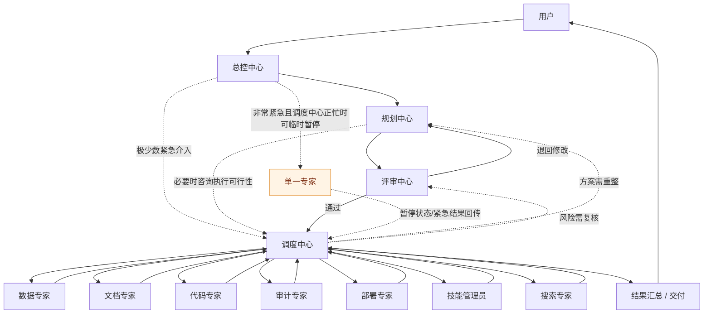
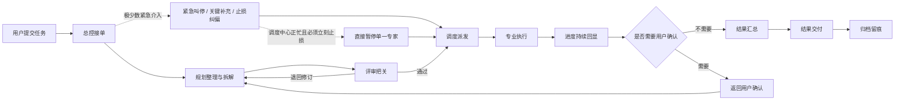

# README 用户视角流程图素材

## 1. 谁能调用谁（简化关系图）

## 2. 任务流程图（用户视角）

## 3. README 中建议采用的用户化说明

README 里应当把这两张图解释为**用户理解系统如何接单、分派、执行与回到自己手里**的入口，而不是解释数据库、事件总线、状态机或前端映射细节。这里可以补充一句：总控中心虽然默认只负责接单与回传，但在**极少数非常紧急**的场景下，允许先向调度中心发出临时止损或关键约束同步指令；若调度中心当时正忙且无法及时接管，而某个 specialist 又必须立刻停下，总控中心才可临时直达该**单一 specialist** 下达“立即暂停/等待进一步指令”的短指令。这仍是一条受约束例外路径，不应被表述成常规流程。技术实现、状态枚举、内部兼容字段与详细架构链路应统一下沉到独立技术文档，例如 `docs/current_architecture_overview.md`。
