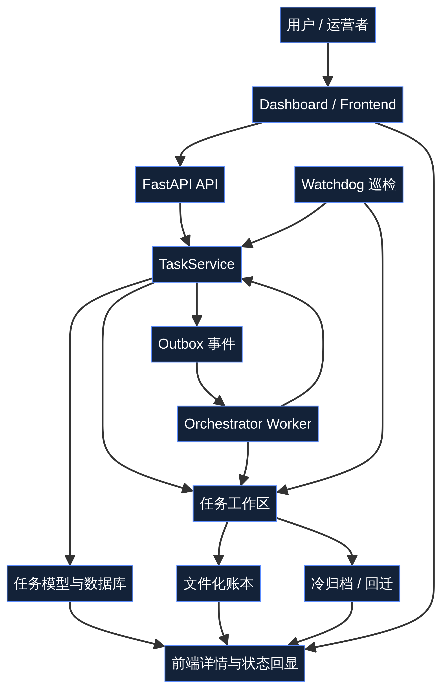
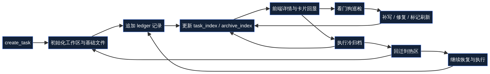

# Multi-Agent Orchestrator 技术文档

> 本文档面向维护者、二次开发者与部署侧工程人员，重点解释当前公开仓库中已经落地的底层机制、模块边界与处理链路，尤其是本轮新增的**任务工作区、文件化账本、冷热分层、冷归档与回迁、`/new` 刷新规则、看门狗巡检修复、飞书汇报回写、前端操作入口补齐**等能力。[1] [2] [3] [4] [5]

## 一、文档目标与范围

当前仓库经过现代化改造后，已经不再适合用单一 README 同时承担用户介绍、产品说明、技术设计、阶段记录与临时排查结论。因此，技术说明被独立收口到本文档中，用来回答三个核心问题：第一，系统现在的真实底层结构是什么；第二，本轮新增机制分别落在哪些层级；第三，后续继续维护时应从哪里切入，而不是误把历史遗留说明当成当前主线。[1] [2] [3]

从范围上看，本文档只描述**当前仓库中已经存在并可复查**的实现，不把尚未落地的长期设想混入主叙事。对于阶段性背景与任务执行痕迹，则继续以交付说明、Todo 与 E2E 验证结果作为旁证材料。[2] [4] [5]

| 文档 | 主要读者 | 解决的问题 |
| --- | --- | --- |
| `README.md` | 公开访客、首次阅读者 | 项目是什么、入口在哪、该先看什么 |
| `docs/user-guide.md` | 使用者、协作者 | 任务如何进入、推进、交付与归档 |
| `docs/technical-architecture.md` | 维护者、开发者、部署者 | 底层机制如何实现、模块如何分工 |
| `TODO_task_workspace_ledger.md` | 改造执行者 | 本轮改造到底做了哪些事 |
| `agentorchestrator/E2E_task_workspace_validation_result_2026-04-09.json` | 联调与回归验证者 | 主链路是否真实跑通 |

## 二、总体架构：从“状态机 + 事件驱动”扩展到“工作区 + 账本 + 归档治理”

系统的原始骨架可以概括为：**任务模型作为事实源，状态机约束流转，事件总线驱动自动推进，前端负责可视化与操作适配**。[3] 本轮改造并没有推翻这条主线，而是在其上补上了一个长期缺失的持久化交接层：即**每个任务都有独立工作区与文件化账本**。这使得系统不再只依赖数据库字段和瞬时上下文，而是拥有了跨轮次、跨角色、跨归档状态的稳定恢复面。[1] [2] [4]

因此，当前更准确的整体架构应理解为：**数据库中的任务对象负责结构化状态，任务工作区负责上下文承载与交接，账本负责过程沉淀，冷热分层负责存储治理，看门狗负责巡检和修复，前端负责把这些能力暴露为用户可用入口**。[1] [2] [3] [4]



```text
用户/运营者
  ↓
Dashboard / Frontend
  ↓
FastAPI API
  ↓
TaskService
  ↓
任务模型（数据库） + Outbox 事件
  ↓
Orchestrator Worker / 调度逻辑
  ↓
任务工作区（README / TODO / HANDOFF / TASK_RECORD / context / ledger）
  ↓
冷归档 / 回迁 / 巡检 / 汇报
  ↓
前端详情、卡片、索引与恢复入口回显
```

## 三、分层结构与职责边界

为避免后续维护时把“前端看板”“任务状态机”“工作区脚本”“巡检逻辑”混为一谈，当前仓库可以按六层理解：公开文档层、前端操作层、后端 API 层、任务领域层、工作区与账本层、治理与巡检层。[1] [2] [3]

| 层级 | 主要位置 | 核心职责 | 本轮变化 |
| --- | --- | --- | --- |
| 公开文档层 | `README.md`、`docs/*` | 统一公开口径、用户说明与技术说明 | 增加双文档体系入口 [1] |
| 前端操作层 | `agentorchestrator/frontend/src/*`、`dashboard/` | 任务发布、详情查看、归档回迁、搜索与技能入口 | 补齐任务工作区与归档操作入口 [2] |
| 后端 API 层 | `agentorchestrator/backend/app/main.py`、`api/*` | 暴露任务、状态、管理与实时接口 | 对外提供工作区与新字段返回 [3] |
| 任务领域层 | `models/task.py`、`services/task_service.py` | 维护任务状态机、字段结构与流转规则 | 对齐工作区、看门狗、`/new` 字段 [3] [4] |
| 工作区与账本层 | `task_workspaces/`、`task_workspace.py` | 承接任务文件、账本、索引与恢复文件链 | 本轮新增核心底座 [2] [4] |
| 治理与巡检层 | `task_watchdog.py`、worker、汇报逻辑 | 巡检、修复、归档、回迁、汇报、续接建议 | 本轮新增重点能力 [2] [4] |

## 四、任务工作区：新增的真实交接面

### 4.1 为什么要引入任务工作区

仅靠数据库任务字段来承接复杂协作，存在两个问题。第一，数据库更适合表示结构化状态，但不适合承接细粒度交接、上下文恢复与任务文件链。第二，长链路任务一旦跨轮次、跨执行者或跨归档状态处理，单纯依赖即时上下文非常脆弱。因此，本轮为每个任务创建**独立任务工作区**，让任务拥有稳定的文件承载面。[2] [4]

### 4.2 工作区初始化内容

当前任务创建后，会自动初始化一组标准文件与目录，这一规则已经在 Todo 设计与联调验证中被明确记录。[2] [4]

| 文件或目录 | 作用 | 说明 |
| --- | --- | --- |
| `README.md` | 任务概览 | 作为进入该任务的第一入口 |
| `TODO.md` | 待办清单 | 表达任务剩余事项与推进状态 |
| `TASK_RECORD.json` | 结构化事实 | 保存任务编号、策略、状态与路径元数据 |
| `HANDOFF.md` | 交接说明 | 用于跨 Agent、跨轮次恢复 |
| `LINKS.md` | 关联路径与链接 | 汇总引用文件与相关线索 |
| `STATUS.json` | 当前状态快照 | 面向脚本与界面读取 |
| `context/latest_context.json` | 最新上下文摘要 | 用于高压上下文下恢复 |
| `ledger/*.jsonl` | 过程账本 | 追加式记录进度、汇报与修复信息 |
| `exports/` | 导出与恢复摘要 | 保存 resume export 等结果 |
| `agent_notes/` | 角色笔记 | 便于保留执行侧局部说明 |

### 4.3 工作区与数据库的关系

工作区并不是数据库的替代品，而是数据库任务对象的文件化补充层。数据库仍然是任务的结构化事实源；工作区则负责保留更适合文件表达的交接面、恢复面与扩展面。两者之间通过任务服务、索引文件与前端字段输出保持一致。[3] [4]

## 五、文件化账本：让进度、交接与汇报具备长期记忆

引入工作区之后，还必须解决“任务过程如何持续写回”的问题。因此，本轮实现了**文件化账本机制**。账本并不是一个巨大的单文件快照，而是按事件类型和用途拆分的 `jsonl` 追加式记录，适合被脚本、服务与人工共同读取。[2] [4]

这种设计的核心价值在于：一方面，追加式账本天然适合长期积累；另一方面，它允许在不破坏既有记录的前提下持续补写、审计与恢复。相比“每次都覆盖同一个状态文件”，账本更能体现治理过程的完整性。[2]



| 账本类型 | 典型内容 | 主要用途 |
| --- | --- | --- |
| 进度账本 | 进度追加、摘要补写 | 恢复执行过程 [2] |
| 交接账本 | 续接摘要、关键说明 | 跨轮次恢复 [2] |
| 汇报账本 | 飞书发送结果与内容预览 | 审计外部汇报 [2] [4] |
| 巡检账本 | 看门狗巡检与修复动作 | 审计自动治理过程 [2] |

## 六、索引体系：让任务可检索、可归档、可回迁

工作区与账本落地之后，还必须解决“系统如何知道这些目录和任务之间的关系”。本轮因此补上了**任务索引与归档索引**。索引负责按任务代号、任务 ID、冷热状态、归档位置与恢复状态快速定位任务。[2]

联调结果显示，当前 `task_index` 与 `archive_index` 已经能够同步暴露 `archive_status`、`processing_location`、`watchdog_status`、`refresh_recommended`、`new_refresh` 等关键字段，并且索引一致性验证通过。[4]

## 七、冷热分层与归档回迁：存储治理层的现代化改造

### 7.1 冷热分层的目标

大型任务或长期累积项目如果始终留在热区，会让工作目录不断膨胀，影响读取、维护与部署管理。因此，本轮引入**冷热分层策略**：将持续处理中的任务保留在热区；将已完成或阶段性封存的任务迁入冷区；在需要继续处理时，再把任务回迁到热区。[2] [4]

### 7.2 超大任务的冷层优先策略

Todo 中已明确提出，对经评估可能超过 `50GB` 的项目，创建时可直接落在机械硬盘工作区，仅在固态盘保留必要索引、元数据与快速访问缓存。这并不改变任务模型本身，但改变了其物理处理位置与存储治理策略。[2]

### 7.3 归档与回迁的实现意义

传统“归档”往往意味着任务生命周期结束，而当前系统中的归档是**可逆治理动作**。任务进入冷区后，并不是失去处理能力，而是从活跃处理状态切换为历史沉淀状态；一旦再次需要处理，可以重新激活并回迁到热区，继续沿用既有工作区和账本链路。[2] [4]

| 状态 | 存储语义 | 是否可继续处理 |
| --- | --- | --- |
| `hot` | 热区活跃工作区 | 可以 |
| `cold` | 冷归档工作区 | 默认不活跃，但可回迁 |
| `reactivated` | 从冷区返回热区 | 可以 |

## 八、`/new` 规则：上下文治理而不是简单重开

复杂任务执行一段时间后，真正的问题往往不是“状态丢失”，而是“上下文过载”。本轮新增的 `/new` 判断机制，就是为了解决这种问题。它会综合上下文窗口压力、看门狗状态、待办数量、进度计数与流程计数等信息，生成结构化建议，包括是否应刷新、严重程度、触发原因、建议动作与标准恢复顺序。[2] [4]

E2E 结果中可见，当前 `/new` 结构至少已经包括 `should_refresh`、`severity`、`reason`、`trigger_codes`、`recommended_action` 与 `resume_order` 等字段，其中标准恢复顺序为 `README.md → HANDOFF.md → TODO.md → TASK_RECORD.json → context/latest_context.json`。[4]

从技术上说，这一机制很关键，因为它把“上下文压力”从隐性的模型状态，转换为可以在任务对象、索引、前端和联调脚本中共同使用的显式字段。[4]

## 九、小任务策略：让治理强度与任务规模匹配

如果所有任务都强制走完整长链路，会抬高简单任务的处理成本。因此，本轮还引入了**小任务策略**，用于区分标准任务与轻量任务在创建、进度记录、归档与留痕上的差异。[2] [4]

当前 E2E 样本中可见，`task_policy` 已经包含 `mode`、`dispatch_strategy`、`progress_strategy`、`ledger_strategy`、`archive_strategy`、`reactivation_strategy` 与 `resume_files` 等字段。这说明任务策略已从“隐含在实现中的默认逻辑”，转化为显式、可输出、可审计的任务元数据。[4]

## 十、看门狗：自动巡检与修复建议层

### 10.1 设计目标

看门狗不是一个“神秘后台线程”，而是一套明确的巡检与修复机制。它的目标是发现任务缺失、状态异常、账本不一致、上下文压力过高或需要恢复的情况，并把这些信息反馈到任务对象、账本、索引与前端展示中。[2] [4]

### 10.2 当前实现形态

根据 Todo 与交付说明，本轮已经明确采用**独立脚本 / 定时任务**作为第一落地点，而不是首先强行把看门狗实现为一个内嵌 Agent。这样做的好处是部署方式更直接、逻辑更清晰，也便于后续再升级为更强的守护形态。[2]

### 10.3 输出内容与修复动作

当前看门狗至少会输出最近巡检时间、当前健康状态、最近异常、最近修复动作与推荐动作；必要时还能补写 `TASK_RECORD.json`、修复账本、标记需要 `/new` 刷新，并在条件满足时触发通知链路。[2] [4]

| 字段 | 含义 | 当前来源 |
| --- | --- | --- |
| `status` | 健康状态，如 `healthy`、`attention` | 看门狗结果 [4] |
| `checked_at` | 最近巡检时间 | 看门狗结果 [4] |
| `issues` | 本次发现的问题列表 | 巡检输出 [4] |
| `repairs` | 已执行修复动作 | 巡检输出 [4] |
| `recommended_action` | 建议下一步 | 巡检与 `/new` 联动 [4] |

## 十一、飞书汇报：外部通知链路的结构化回写

本轮还实现了任务服务统一发送策略，用于在任务创建、状态变更、进度追加、归档回迁与巡检节点进行飞书汇报，并把汇报结果回写到任务工作区元数据与 `ledger/reports.jsonl` 中。[2] [4]

技术上值得注意的点有两个。第一，汇报不是单纯的即时消息，而是带有结构化回写字段，例如 `enabled`、`channel`、`last_status`、`last_event`、`last_agent`、`last_summary` 与 `last_reported_at`。第二，本轮联调虽然采用本地模拟发送，但回写链路已经按真实发送流程校验通过，因此后续接入真实 webhook 的工作重点将从“逻辑补全”转为“外部通道验证”。[4] [5]

## 十二、前端改造：把底层机制真正暴露给用户

### 12.1 为什么前端必须同步升级

如果工作区、账本、归档、回迁、看门狗和 `/new` 规则只存在于后端结构中，而前端看不到、点不到、也无法理解，那么这些机制对实际使用者而言几乎等于不存在。因此，本轮除了底座改造之外，还同步补齐了前端字段与操作入口。[2] [5]

### 12.2 当前已接入的前端能力

根据 Todo 与交付说明，前端目前已经补齐如下能力：任务代号展示、工作区路径展示、`README` / `TODO` / `TASK_RECORD` / `HANDOFF` / `LINKS` / `STATUS` 入口、`latest_context` 与 `resume_export` 路径入口、账本与归档路径入口、冷归档操作、重新激活到热盘操作、任务类型标签、`/new` 建议、看门狗状态与飞书汇报状态。[2] [5]

这说明前端已经从“仅展示状态”的层级，提升为“可以进入任务文件世界、可以触发归档治理动作、可以理解恢复建议”的治理操作面。[2]

## 十三、统一联调：如何证明这些机制不是纸面设计

本轮不是只写文档或改结构名，而是完成了统一 E2E 联调验证。联调覆盖至少十二项检查，包括任务创建、进度与 Todo 回写、状态流转、归档、回迁、看门狗、修复动作、`/new` 规则、工作区文件存在性、任务索引、归档索引、飞书汇报与索引一致性。当前结果 `all_passed = true`。[4]

| 检查项 | 结果 |
| --- | --- |
| `create_task` | 通过 [4] |
| `progress_todos_transition` | 通过 [4] |
| `archive_workspace` | 通过 [4] |
| `reactivate_workspace` | 通过 [4] |
| `watchdog` | 通过 [4] |
| `watchdog_repair` | 通过 [4] |
| `new_refresh_rule` | 通过 [4] |
| `workspace_files` | 通过 [4] |
| `task_index` | 通过 [4] |
| `archive_index` | 通过 [4] |
| `feishu_reporting` | 通过 [4] |
| `index_consistency` | 通过 [4] |

这一点非常重要，因为它意味着当前这些机制并不是“设计稿级能力”，而是已经在本地真实环境中形成了可验证闭环。[4] [5]

## 十四、当前维护建议

后续继续维护时，建议遵循以下顺序。首先，从 `README.md` 与 `docs/user-guide.md` 理解公开口径和用户逻辑；其次，再读本文档理解底层设计；最后，再按 `models/task.py`、`services/task_service.py`、`services/task_workspace.py`、`task_watchdog.py` 与前端组件逐步进入实现细节。[1] [3] [4]

| 顺序 | 文件或模块 | 目的 |
| --- | --- | --- |
| 1 | `README.md` | 先建立公开主入口认知 |
| 2 | `docs/user-guide.md` | 理解用户视角与流程 |
| 3 | `docs/technical-architecture.md` | 理解底层机制与模块边界 |
| 4 | `agentorchestrator/backend/app/models/task.py` | 理解任务模型与状态结构 |
| 5 | `agentorchestrator/backend/app/services/task_service.py` | 理解任务创建、更新与字段输出 |
| 6 | `agentorchestrator/backend/app/services/task_workspace.py` | 理解工作区与账本逻辑 |
| 7 | `agentorchestrator/scripts/task_watchdog.py` | 理解巡检与修复实现 |
| 8 | `agentorchestrator/frontend/src/components/TaskModal.tsx` | 理解前端如何暴露这些能力 |

## 十五、版本日志

| 日期 | 变更 |
| --- | --- |
| 2026-04-09 | 首次形成独立技术文档，系统梳理任务工作区、文件化账本、冷热分层、归档回迁、`/new` 规则、看门狗、飞书汇报、前端接入与统一联调结论，并补入技术流程图 [1] [2] [4] [5] |

## 十六、结论

综上，当前项目的真实技术形态可以概括为：**以任务模型为事实源，以状态机与事件驱动为推进骨架，以任务工作区和文件化账本为稳定交接面，以冷热分层、归档回迁和看门狗为治理增强层，以前端详情与看板为公开操作面**。[1] [2] [3] [4] [5]

这也意味着，当前仓库已经从“可展示多角色协作概念”的阶段，推进到“具备任务治理、路径可见、上下文可恢复、历史可审计、归档可回迁”的工程底座阶段。后续若继续增强，重点应放在真实外部 webhook 联调、部署级自动化、前端交互强化与持续回归体系，而不是重新回到本轮已经完成的基础机制补齐阶段。[4] [5]

## References

[1]: ../README.md "项目首页 README"
[2]: ../TODO_task_workspace_ledger.md "任务工作区与账本改造 Todo"
[3]: ./current_architecture_overview.md "当前架构与处理逻辑总览"
[4]: ../agentorchestrator/E2E_task_workspace_validation_result_2026-04-09.json "E2E 联调验证结果"
[5]: ../agentorchestrator/DELIVERY_task_workspace_final_2026-04-09.md "最终交付说明"
