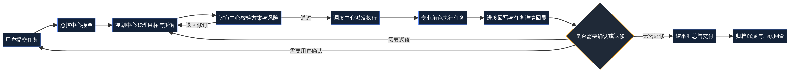
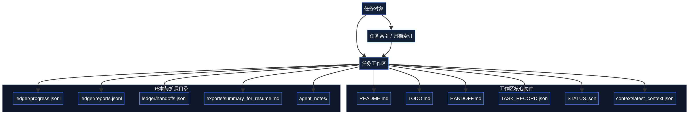
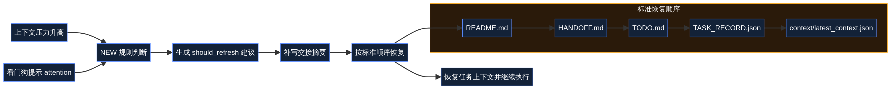
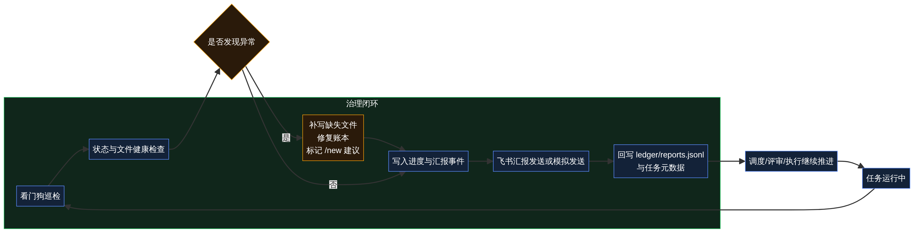

# Multi-Agent Orchestrator 用户文档

> 本文档面向使用者、协作者与项目观察者，重点解释这套系统**如何接收任务、如何推进任务、如何回看结果，以及为什么它能够在复杂协作场景中保持可追溯与可治理**。[1] [2] [3] [4]

## 一、这是什么项目

**Multi-Agent Orchestrator** 是一套面向复杂任务协作的多智能体编排系统。它并不把多个 Agent 简单叠加成一个聊天窗口，而是把任务放进一条有治理节点、有状态回显、有历史沉淀、也有归档与回迁机制的执行链路中。[1] [2] [3] 对用户而言，这意味着任务不是“发出去就失联”的黑盒，而是一个**有入口、有过程、有结果、有历史**的工作系统。

从当前公开版本的实际能力来看，这个项目已经具备任务发布、规划评审、调度执行、任务详情查看、工作区留痕、账本沉淀、冷热分层归档、归档回迁、巡检修复与看板展示等完整主线能力。[1] [2] [3] [4] 这也是它与普通聊天式 Agent 演示页最核心的区别。

| 维度 | 用户可直接感知的含义 | 当前状态 |
| --- | --- | --- |
| 任务入口 | 需求先进入统一入口，再进入治理链路 | 已落地 [1] [2] |
| 过程可见 | 可在看板与详情中看到状态、路径、建议与历史 | 已落地 [1] [3] |
| 结果可追溯 | 每个任务都有工作区、账本与上下文恢复文件 | 已落地 [2] [4] |
| 归档可治理 | 已完成任务可冷归档，后续仍可回迁继续处理 | 已落地 [2] [4] |
| 巡检可恢复 | 看门狗会发现异常并记录修复动作或建议 | 已落地 [2] [4] |

## 二、用户如何理解整条任务主线

从用户视角看，系统的主逻辑可以概括为：**先接单，再整理，再评审，再派发，再执行，再交付，再归档**。[1] [3] 这条主线并不是装饰性的流程图，而是公开版当前已经实现并完成联调验证的运行方式。[2] [4]

在这条链路中，总控中心并不长期代替专业角色工作，而是负责把用户的任务纳入治理流程。规划中心负责把任务结构化，评审中心负责把关，调度中心负责把任务送到合适的执行角色，执行角色负责真正产出结果。必要时，任务还会回到评审或规划节点继续修整，以避免错误结果被直接交付。[1] [3]

| 阶段 | 用户通常会看到什么 | 系统此时在做什么 |
| --- | --- | --- |
| 提交任务 | 输入标题、描述或模板内容 | 创建任务对象并初始化工作区 [2] |
| 规划整理 | 任务进入处理中 | 生成拆解思路、待办与续接基础 [2] [3] |
| 审核把关 | 任务可能短暂停留或退回 | 校验方案完整性与风险 [3] |
| 调度执行 | 任务持续推进并回显动态 | 将任务交给合适角色执行 [3] |
| 结果交付 | 看到输出、摘要与历史 | 汇总结果并准备交付 [1] [4] |
| 归档沉淀 | 任务可进入冷归档状态 | 保留历史，并支持后续回迁 [2] [4] |

## 三、任务工作区：为什么每个任务都有独立目录

本轮改造最重要的变化之一，是系统不再只依赖数据库字段或零散日志来承接任务上下文，而是为每个任务建立**独立任务工作区**。任务一旦创建，系统就会生成一组基础文件，包括 `README.md`、`TODO.md`、`TASK_RECORD.json`、`HANDOFF.md`、`LINKS.md`、`STATUS.json`、`context/latest_context.json` 以及 `ledger/*.jsonl` 等内容。[2] [4]

这意味着，任务不再只能通过“还记不记得上一轮对话”来恢复，而是可以通过文件化工作区进行跨轮次、跨角色、跨归档状态的续接。对用户来说，这直接带来的价值是：**任务更稳定，恢复更可信，交接更容易复核**。[2] [4]

| 文件或目录 | 用户视角下的含义 | 作用 |
| --- | --- | --- |
| `README.md` | 任务总览入口 | 快速理解任务当前目标与状态 [2] |
| `TODO.md` | 任务待办清单 | 看到还剩哪些事项待推进 [2] |
| `HANDOFF.md` | 交接摘要 | 用于跨轮次恢复与换人续接 [2] |
| `TASK_RECORD.json` | 结构化记录 | 保存任务事实与关键元数据 [2] |
| `context/latest_context.json` | 最新上下文快照 | 用于高压上下文场景下恢复 [4] |
| `ledger/*.jsonl` | 过程账本 | 记录进度、汇报、修复与交接历史 [2] [4] |

## 四、冷热分层、冷归档与回迁：为什么历史任务不会阻塞当前处理

当项目变大、历史任务增多，所有任务都长期留在热盘会让系统越来越重。本轮改造引入了**冷热分层存储机制**：需要持续处理的任务留在热区，已完成或暂时不活跃的任务可进入冷归档区；如果后续又需要继续处理，则可以把归档任务回迁到热区继续推进。[2] [4]

这种设计并不只是为了节省空间，更重要的是把“当前处理”和“历史沉淀”分开治理。用户在前端中可以看到任务是否处于冷归档状态、是否可以重新激活，以及回迁后的路径和状态变化。[1] [2] [4]

| 状态 | 含义 | 用户可见能力 |
| --- | --- | --- |
| Hot | 当前活跃任务，保留在热工作区 | 正常查看、推进、补写与协作 [2] |
| Cold | 已归档到冷区的任务 | 可查看归档信息与回迁入口 [2] [4] |
| Reactivated | 已从冷区重新激活到热区 | 可以继续执行、补写与回显 [4] |

## 五、`/new` 规则：什么时候建议刷新上下文

复杂任务在长链路运行中，经常会遇到“上下文太长、历史太多、当前摘要不够清楚”的情况。为此，本轮改造补上了 `/new` 判断机制。系统会根据上下文窗口状态、看门狗状态、待办数量、进度条目、流程记录等信息判断是否建议刷新，并给出恢复顺序与建议动作。[2] [4]

对用户来说，这并不意味着任务丢了，而是意味着系统已经主动提示：**现在更适合先写交接摘要，再从标准恢复文件链继续推进**。统一联调结果也已经验证了 `/new` 建议、恢复顺序与索引回写的一致性。[4]

> 当系统提示需要 `/new` 时，推荐按 `README.md → HANDOFF.md → TODO.md → TASK_RECORD.json → context/latest_context.json` 的顺序恢复，这一顺序已经被写入工作区与索引结构中。[4]

## 六、小任务与标准任务：为什么不是所有事情都走同一条重流程

这套系统虽然强调治理，但并不是把所有事情都强行拉进最重的流程。本轮也补上了**小任务策略**，用于区分标准任务与轻量任务在创建、留痕、流转和归档上的差异。[2] [4] 这样做的目标，不是降低治理，而是让治理与任务复杂度相匹配。

| 任务模式 | 适用情况 | 主要特点 |
| --- | --- | --- |
| Standard | 复杂、长链路、多人协作任务 | 完整工作区、完整账本、完整归档策略 [2] [4] |
| Lightweight | 较短、较快、低依赖任务 | 更轻量的推进与留痕，但仍保留可恢复入口 [2] |

## 七、看门狗与飞书汇报：系统如何减少“任务悄悄失控”

为了避免任务长时间卡住而无人察觉，本轮实现了看门狗机制。看门狗会巡检任务状态，输出最近巡检时间、健康状态、异常摘要与推荐动作；在必要时，它还可以补写缺失文件、修复账本、标记需要刷新上下文，或触发进一步处理建议。[2] [4]

与此同时，系统也接入了飞书汇报回写链路。当前实现支持在任务创建、状态流转、进度追加、归档回迁与巡检节点写入汇报结果，并把发送状态回写到工作区元数据和 `ledger/reports.jsonl` 中。虽然本轮联调使用的是本地模拟发送，但链路闭环已经验证通过。[2] [4]

| 机制 | 作用 | 当前验证状态 |
| --- | --- | --- |
| 看门狗巡检 | 发现停滞、缺失或异常状态 | 已通过联调 [4] |
| 修复动作 | 补写文件、修复账本、标记 `/new` 建议 | 已通过联调 [4] |
| 飞书汇报 | 回写任务关键事件与状态摘要 | 已通过联调（模拟发送）[4] |

## 八、前端界面里现在能看到什么

本轮不只是补底座，也补齐了前端操作入口。现在用户可以在任务详情和任务卡片中看到任务代号、工作区路径、`README` / `TODO` / `TASK_RECORD` / `HANDOFF` / `LINKS` / `STATUS` 等文件入口，也可以看到账本、上下文、归档路径、冷归档状态、回迁操作、`/new` 建议、看门狗状态与飞书汇报状态。[1] [2] [4]

这说明前端已经不再只是“一个看板壳子”，而是成为任务治理、路径查看与归档操作的真实入口。对用户来说，这使得任务从创建到回看形成了更完整的闭环。[1] [2]

| 前端模块 | 当前作用 | 与本轮改造的关系 |
| --- | --- | --- |
| 任务发布 | 统一任务入口 | 承接治理主线入口 [1] |
| 任务卡片与详情 | 展示代号、状态、路径、建议与操作 | 承接工作区、账本、归档与巡检信息 [2] [4] |
| 冷归档/回迁操作 | 显式执行归档与重新激活 | 承接冷热分层机制 [2] |
| 技能管理 / 搜索等面板 | 补充不同类型任务入口 | 与统一后台任务链路对齐 [1] |

## 九、建议的阅读顺序

如果你是第一次接触这个仓库，最稳妥的阅读顺序不是直接进入代码，而是先从公开主入口理解项目，再按本文档理解使用逻辑，最后再进入技术文档查看底层实现。[1] [3]

| 顺序 | 建议阅读对象 | 目的 |
| --- | --- | --- |
| 1 | `README.md` | 先理解项目定位、界面入口与文档导航 [1] |
| 2 | `docs/user-guide.md` | 站在用户角度理解任务主线与新机制 [1] [2] |
| 3 | `docs/technical-architecture.md` | 理解工作区、账本、编排与巡检实现 [2] [3] [4] |
| 4 | `TODO_task_workspace_ledger.md` | 回看本轮改造范围与落地清单 [2] |

## 十、版本日志

| 日期 | 变更 |
| --- | --- |
| 2026-04-09 | 首次形成独立用户文档，系统说明任务工作区、账本、冷热分层、归档回迁、`/new` 规则、看门狗、飞书汇报与前端入口，并补入用户视角流程图 [1] [2] [4] |

## 十一、结论

综合来看，当前的 **Multi-Agent Orchestrator** 已经从早期的多角色协作原型，推进为一套更强调**任务治理、路径可见、历史可追溯、归档可回迁、异常可修复**的协作系统。[1] [2] [3] [4] 对外最准确的理解方式，不是“多个 Agent 一起聊天”，而是“一个有工作区、有账本、有状态机、有归档与巡检机制的多智能体任务系统”。

## References

[1]: ../README.md "项目首页 README"
[2]: ../TODO_task_workspace_ledger.md "任务工作区与账本改造 Todo"
[3]: ./current_architecture_overview.md "当前架构与处理逻辑总览"
[4]: ../edict/E2E_task_workspace_validation_result_2026-04-09.json "E2E 联调验证结果"
