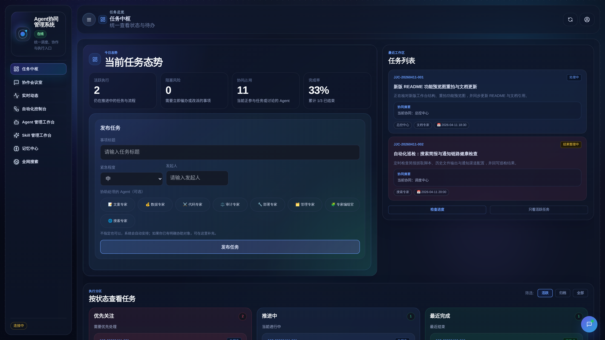
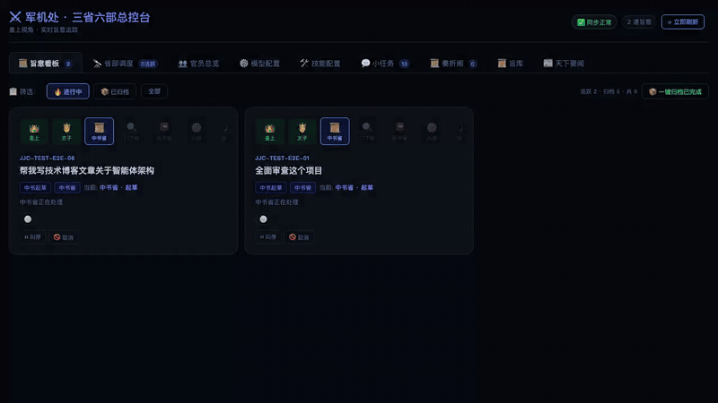
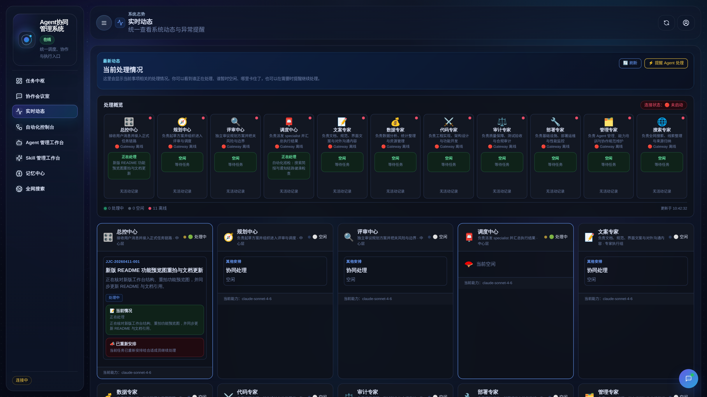
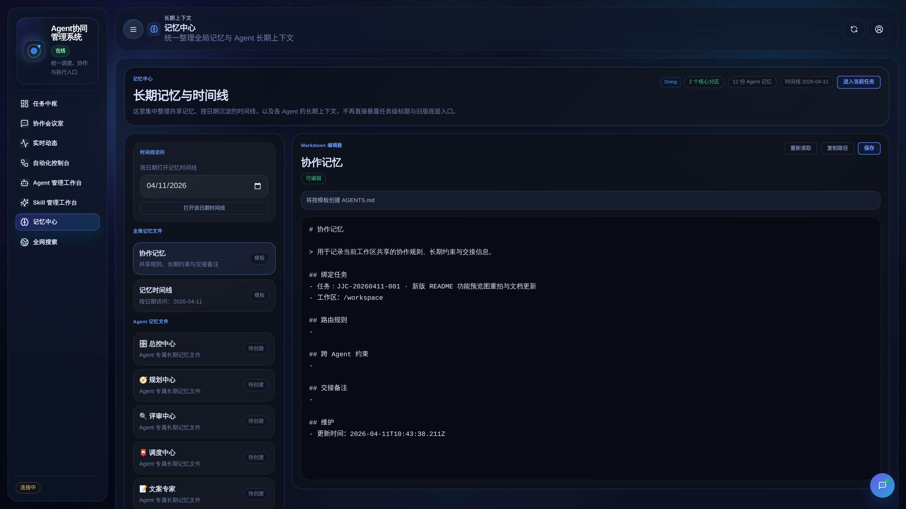
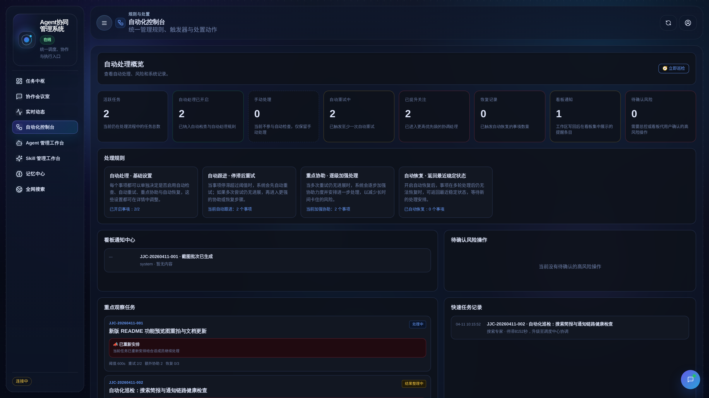
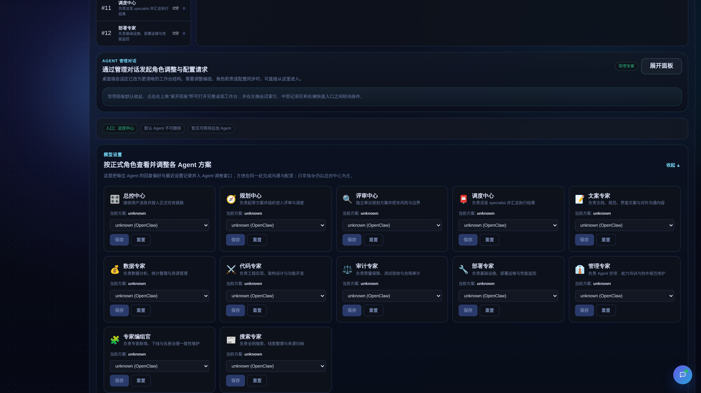
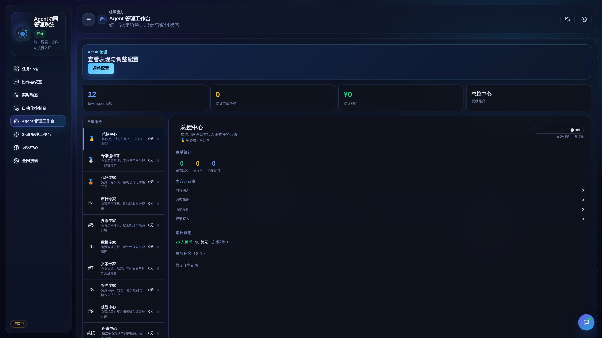
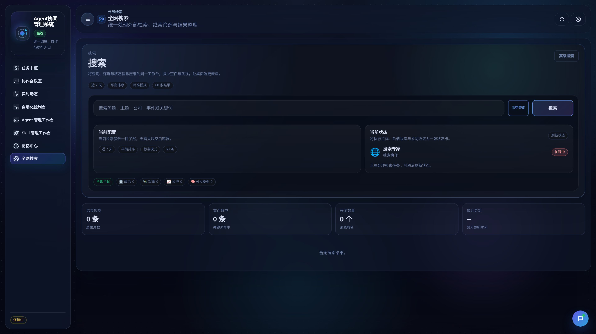
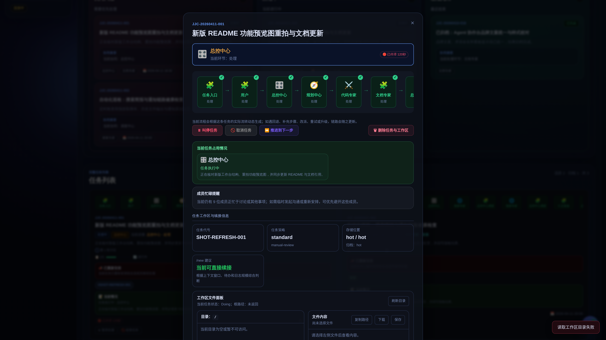
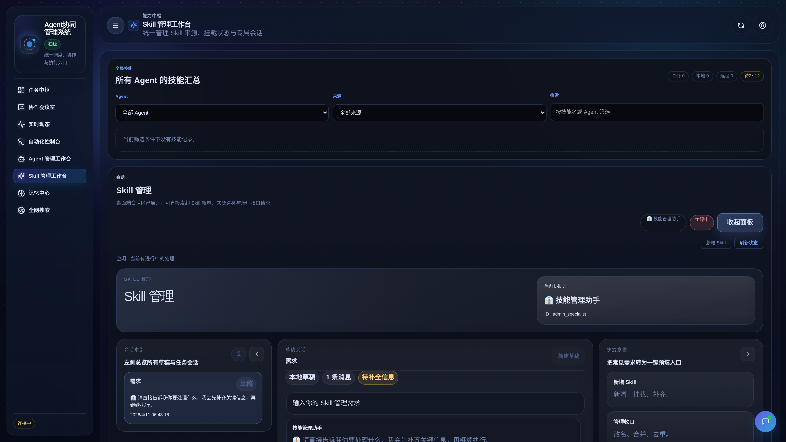

# 我用分层制衡协作重构了 AI 多 Agent 生产架构

> 以制度化分工与强制审核为核心的协作设计，比只强调自由对话的多 Agent 框架更接近可治理的生产系统。



---

## 一、一个奇怪的想法

去年底我开始重度使用 AI Agent 干活——写代码、做分析、生成文档。用的是市面上最火的几个多 Agent 框架。

用了一个月，我发现一个根本性的问题：

**这些框架没有"审核"这个概念。**

CrewAI 的模式是：几个 Agent 各自干活，做完就交。AutoGen 好一点，有个 Human-in-the-loop，但本质上是你自己当 QA。MetaGPT 有角色分工，但审核是可选的。

就像一家公司没有 QA 部门，工程师写完代码直接部署到线上。

然后你拿到最终结果，不知道中间发生了什么，无法复现，无法审计，无法干预。出了问题只能重跑。

我一直在想：有没有一种架构，天然就把审核嵌入到流程里，不是可选的插件，而是必须经过的关卡？

然后有一天，我在翻《资治通鉴》的时候突然想到——

**分层制衡的协作治理。**

历史制度给了一个很强的启发：规划、审核、调度、执行应该分层负责，彼此制衡。放到今天的多 Agent 系统里，就是 **总控中心负责入口治理，规划中心负责拆解，评审中心负责把关，调度中心负责派发，专业执行组负责落地**，任何正式任务都必须经过审核后再进入执行。

这不就是我要找的架构吗？


*▲ 每天第一次打开看板，会有一个开场动画——仪式感拉满*

---

## 二、古人的架构设计

这种分层制衡协作不是一个 metaphor，它是一套经过长期实践检验的治理思路。

简化一下，信息流是这样的：

```
用户（你）
  ↓ 提交任务
总控中心（入口治理）  ← 识别闲聊 / 正式任务，提炼标题与上下文
  ↓ 进入规划
规划中心（任务拆解）  ← 把目标拆成可执行子任务
  ↓ 提交审核
评审中心（质量把关）  ← 审查方案质量，不合格就退回修订
  ↓ 通过
调度中心（派发协调）  ← 分配给专业执行组并持续跟踪
  ↓
专业执行组（执行）    ← 数据 / 文案 / 代码 / 合规 / 部署 / Agent 管理等专家处理
  ↓
调度中心汇总交付      ← 结果回传给你
```

注意这里最关键的一步：**评审中心审核**。

规划中心拆完方案后，不是直接扔给执行层——必须先经过评审中心审核。评审中心会检查：

- 子任务拆解是否合理？有没有遗漏需求？
- 专家分配是否准确？该派代码专家的是不是错派给了文案专家？
- 方案是否可执行？有没有不切实际的地方？

如果不合格，评审中心可以**退回修订**——直接打回让规划中心重新规划。不是一个 warning，而是强制返工。

这就是为什么唐朝能运转 289 年。**不受制约的权力必然会出错**，唐太宗想得很清楚。

---

## 三、我把它做成了开源项目

我搭了一个真正的 **多Agent智作中枢**。多中心与专业执行组各司其职，严格按照权限矩阵通信。

项目现已统一升级为 **多Agent智作中枢**，并持续保留其开源实现：

**GitHub：https://github.com/JiangNanGenius/multi-agent-orchestrator**

核心架构很简单：

- **总控中心**：接收入口消息，识别闲聊或正式任务，整理标题与上下文
- **规划中心**：规划方案，拆解子任务
- **评审中心**：审议方案，质量把关，不合格直接退回修订
- **调度中心**：通过审核后派发给专业执行组，协调执行，汇总结果
- **专业执行组**：数据专家、文档专家、代码专家、审计专家、部署专家、Agent 管理专家等
- **AI 搜索引擎**：由搜索专家驱动全网检索、筛选与结果归纳，搜索任务默认以低优先级进入系统，并支持高级搜索设置、自动分配与手动多选指定专家

每个 Agent 有独立的 Workspace、独立的 Skills、独立的 LLM 模型。严格的权限矩阵——谁能给谁发消息，白纸黑字：

| 谁 ↓ 给谁发 → | 规划中心 | 评审中心 | 调度中心 | 专业执行组 |
|:---:|:---:|:---:|:---:|:---:|
| **规划中心** | — | ✅ | ✅ | ❌ |
| **评审中心** | ✅ | — | ✅ | ❌ |
| **调度中心** | ✅ | ✅ | — | ✅ |
| **专业执行组** | ❌ | ❌ | ✅ | ❌ |

规划中心不能直接指挥专业执行组，专业执行组不能越级上报规划中心。所有跨层通信必须经过调度中心中转。

**这不是装饰性的设定，这是架构层面的强制约束。**


*▲ 30 秒 Demo：从开场动画到任务中枢、记忆中心、模型配置的完整巡览*

---

## 四、跟现有框架对比

你可能会问：跟 CrewAI、AutoGen 比，差在哪？

| | CrewAI | AutoGen | **多Agent智作中枢** |
|---|:---:|:---:|:---:|
| 审核机制 | ❌ | ⚠️ 可选 | ✅ 评审中心强制审核 |
| 实时看板 | ❌ | ❌ | ✅ 10 个面板 |
| 任务干预 | ❌ | ❌ | ✅ 叫停 / 取消 / 恢复 |
| 流转审计 | ⚠️ | ❌ | ✅ 完整交付归档 |
| Agent 健康监控 | ❌ | ❌ | ✅ 心跳检测 |
| 热切换 LLM | ❌ | ❌ | ✅ 看板内一键切换 |

最核心的差异是**评审中心审核机制**。

这不是 Human-in-the-loop（那是让你自己当 QA），这是一个专职的 AI Agent 负责审核另一个 AI Agent 的产出。制度性的，强制的，架构级别的。

一个不经审核的 AI 协作系统，就像一个没有代码 review 的团队——跑得快，翻车也快。

---

## 五、协作中枢看板——让一切可观测

光有架构不够，你还得看得见。

所以我做了一个**协作中枢看板**——一个实时监控所有任务流转的 Web 面板。现在它同时保留了 React 前端与手写运行入口两条链路，打开浏览器就能用。

10 个功能面板：

**📋 任务看板**：所有任务以卡片形式展示，按状态分列，支持过滤搜索。每张卡片有心跳徽章——🟢 活跃、🟡 停滞、🔴 告警；长任务还会出现“上下文接近上限 / 已压缩 / 可续写”提示。点开看完整的流转时间线，随时可以叫停或取消。


*▲ 任务看板：任务卡片按状态分列，心跳徽章一目了然*

**🔭 运行调度**：可视化各状态的任务数量、角色分布、Agent 健康卡片，并提供直连调度中心窗口。一眼看清谁在忙、谁在闲、谁宕机了。


*▲ 运行调度：状态分布 + 专家负载 + Agent 健康卡片*

**🗂️ 记忆中心**：新版工作台把长期记忆、跨 Agent 协作记忆与时间线访问统一收口到同一页面。你可以按日期打开时间线、查看全局记忆文件，也能继续维护各个 Agent 的长期上下文，不再沿用旧版“结果归档”单面板口径。


*▲ 记忆中心：长期记忆文件、时间线入口与编辑区集中在同一工作台中展示*

**📜 模板中心**：9 个预设任务模板。选一个，填参数，预览，一键提交。覆盖：周报生成、代码审查、API 设计、竞品分析等常见场景。


*▲ 模板中心：9 个预设模板，填参数一键提交任务*

**⚙️ 模型配置**：每个 Agent 可以独立切换 LLM 模型。规划中心用 Claude 做规划，代码专家用 GPT-4o 写代码，数据专家用 DeepSeek 算数据——各取所长。


*▲ 模型配置：每个 Agent 独立切换 LLM，各取所长*

还有 Agent 管理工作台、技能管理、AI 搜索引擎、会话监控，以及每天首次打开时的开场动画。AI 搜索页现在会直接显示搜索专家当前是否忙碌，并把旧资讯订阅式遗留项收口为高级搜索设置；运行中的长任务如果接近上下文上限，还会触发“上下文窗口管理”机制，提供预警、压缩归档与续写提示。

**运行入口保留零依赖链路**：手写看板仍然是纯 HTML + CSS + JavaScript，可以独立运行；同时项目也提供了 React 前端，便于后续扩展。


*▲ Agent 管理工作台：角色编组、职责摘要与调基入口集中呈现*


*▲ AI 搜索引擎：搜索问题输入、高级搜索设置、搜索专家忙闲状态与低优先级任务入口集中在同一工作台中展示*

---

## 六、跑一个真实案例给你看

光说不练不行。来看一个真实的运行记录——让多Agent智作中枢分析竞品。

**任务**：分析 CrewAI、AutoGen 和 LangGraph 这三个框架的差异，输出对比报告。


*▲ 点开任意任务卡片，可以看到完整的流转链和实时状态*

### 规划中心拆解（45 秒）

规划中心接到任务后，拆成了 4 个子任务：
1. 代码专家 → 架构与通信机制调研
2. 数据专家 → 数据采集与量化对比（GitHub Stars、Contributors 等）
3. 代码专家 → 开发者体验深度评测
4. 文案专家 → 汇总撰写对比报告

### 评审中心审核（32 秒）—— 退回修订了！

**评审中心第一轮直接打回：**

> *"方案有三个问题：1）任务明确要求评测‘可观测性’，但规划里没有对应子任务；2）子任务 1 和 3 都是代码专家调研，有重叠，建议合并；3）缺少推荐场景的结论性子任务——分析没有结论等于没分析。退回修订。"*

规划中心修改方案后，评审中心第二轮通过。

**这就是评审中心的价值。** 如果没有这一步，代码专家会做两次调研，最终报告里也不会有推荐场景——因为原始规划里就没要求。

### 专家执行组处理（17 分钟）

- **代码专家**：技术深度对比，覆盖架构、通信、可观测性三维度
- **数据专家**：量化数据表——Stars、Contributors、Issue 响应时间、Hello World 搭建时长
- **文案专家**：整合代码专家 + 数据专家结果，撰写最终报告

### 结果回传

22 分钟，15800 Token，一份结构化对比报告。结论很有意思：

| 场景 | 推荐 | 理由 |
|------|------|------|
| 快速原型 | CrewAI | 上手最快 |
| 对话式协作 | AutoGen | 天然适合多轮讨论 |
| 复杂工作流 | LangGraph | 状态机最灵活 |
| **可靠性优先** | **多Agent智作中枢** | 唯一内置强制审核 |

---

## 七、技术上的一些选择

做这个项目的时候，我做了几个刻意的技术决策：

**1. 零依赖**

看板前端是一个 HTML 文件，2200 行，没有用任何框架。后端是 Python 标准库的 `http.server`，没有 Flask 也没有 FastAPI。

为什么？因为我不想让人跑之前先 `pip install` 一堆东西。这个项目的目标用户可能只是想快速体验一下制度化多 Agent 协作的流转效果，不想先搭一堆环境。

**2. 每个 Agent 一个 SOUL.md**

每个 Agent 的人格、职责、工作流规则都写在一个 Markdown 文件里。想修改评审中心的审核标准？编辑对应的 `SOUL.md`，下次启动自动生效。

这意味着你可以定制自己的多Agent智作中枢——也许你的“代码专家”并不负责工程，而是负责市场分析。改个 SOUL.md 就行。

**3. 权限矩阵是强制的**

不是“建议”Agent 之间不要越级通信，而是在架构层面强制限制。专业执行组不能给规划中心直接发消息，规划中心也不能绕过评审中心直接让调度中心执行。系统的配置与权限矩阵里白纸黑字写着谁能跟谁说话。

---

## 八、现在你可以试了

项目已经开源，MIT 协议。

**GitHub：https://github.com/JiangNanGenius/multi-agent-orchestrator**

最快的体验方式：先让部署阶段 AI 检查你的 OpenClaw 环境、现有 workspace、模型配置和增量更新需求，再决定是执行一次性初始化脚本，还是仅做前端构建、配置同步与数据刷新。

```bash
git clone https://github.com/JiangNanGenius/multi-agent-orchestrator.git
cd multi-agent-orchestrator
# 先让 AI 读取 README、当前环境状态与现有 workspace 情况
# 再判断应执行一次性初始化，还是改走增量更新路径
```

如果 AI 判断当前环境适合一次性接入，才按建议执行一次性初始化；若判断为增量更新，则只执行对应的构建、同步与刷新命令：

```bash
# 仅当 AI 明确建议进行一次性初始化，且确认适合当前环境时：
bash install.sh

# 若 AI 判断为增量更新，则优先执行：
cd edict/frontend && npm install && npm run build && cd ../..
python3 scripts/sync_agent_config.py
python3 scripts/sync_agents_overview.py
python3 scripts/refresh_live_data.py

# 完成后再打开浏览器检查看板
open http://localhost:7891
```

安装脚本仍然保留，用于创建 Agent Workspace、写入角色配置、生成 Registry / SOUL 相关产物，并输出本地运行配置的只读对接建议清单；但公开推荐顺序已经统一为“先由 AI 完成环境评估，再决定执行一次性初始化脚本还是采用增量命令”。长任务接近上下文上限时，还会进入上下文窗口管理流程。


*▲ 技能管理：各中心与专家已安装的 Skills 一览，可查看详情和添加新技能*

---

## 九、下一步

Phase 1（核心架构）已经完成了。接下来要做的几件事：

- **人工审批模式**：让评审中心的审议结果可以推送到你的飞书/Telegram，你亲自决定通过还是退回修订
- **绩效评估**：每个 Agent 的绩效评分——完成率、返工率、耗时统计
- **实时协作消息流**：看板里加一个实时的 Agent 通信流向图——规划中心发消息给评审中心的时候，连线亮一下
- **知识库与引用溯源**：把历史任务和归档结果沉淀成知识库，新任务可以参考历史经验

完整 Roadmap 在 GitHub 上，Phase 2 和 Phase 3 的每个子项都标了难度，欢迎认领。

---

## 最后

AI Agent 协作的核心问题不是"让 Agent 更聪明"，而是"让 Agent 的协作有规矩"。

CrewAI 解决了"多个 Agent 一起干活"的问题。AutoGen 解决了"Agent 之间能对话"的问题。

但谁来解决"Agent 的产出质量有保障"的问题？

历史制度早就给出过答案：**分权制衡**。规划的不审核，审核的不执行，执行的不规划。每一个环节都有人盯着，每一个决策都要经过审议。

这可能是我见过的、最优雅的"AI 治理"方案——因为它根本不是为 AI 设计的。

它是为**治理**本身设计的。

---

**GitHub：https://github.com/JiangNanGenius/multi-agent-orchestrator**

开源 · MIT · 欢迎继续部署与二次开发
